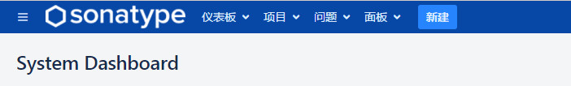
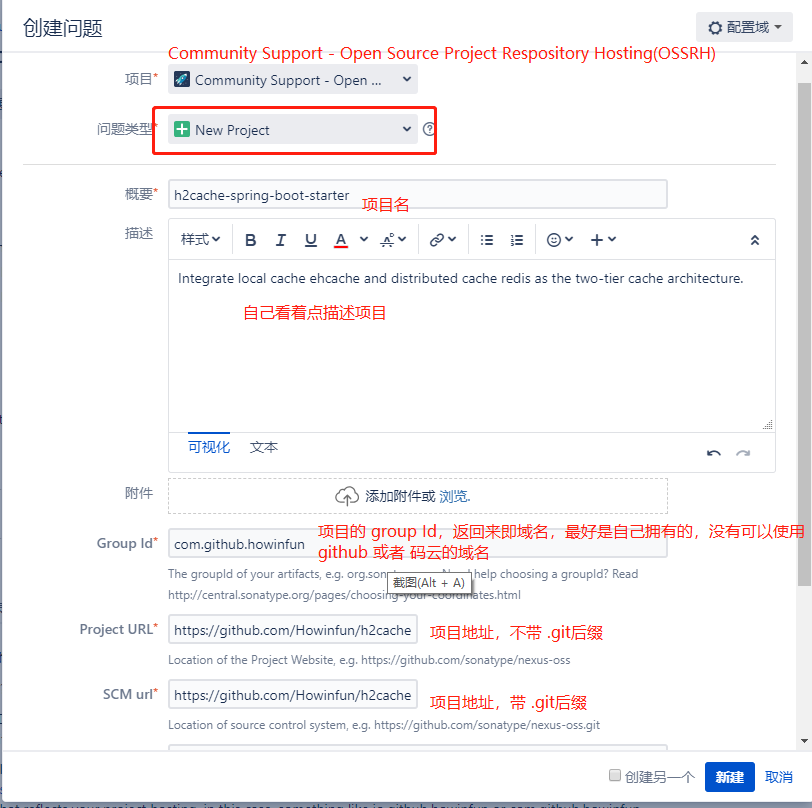
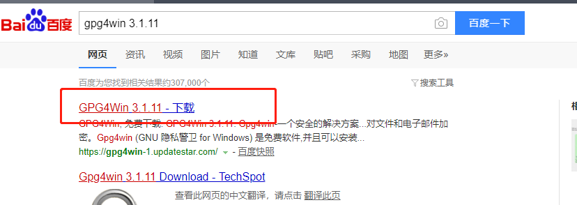
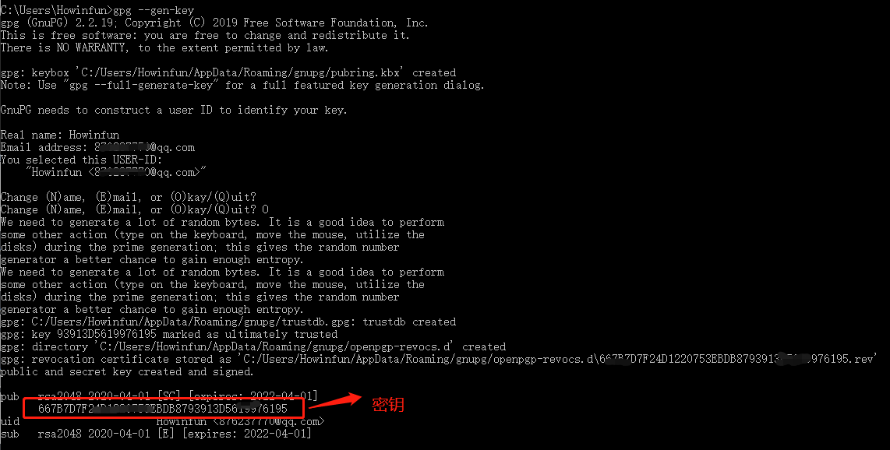
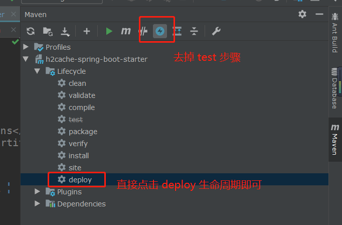
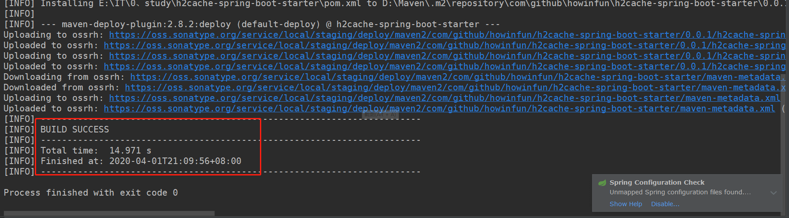
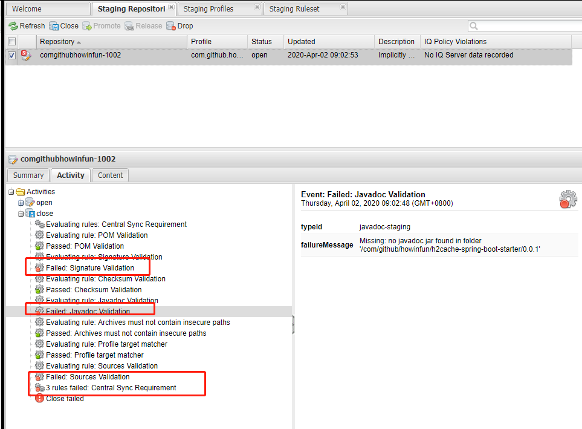

1、注册 sonatype
https://issues.sonatype.org 在这上面注册一个帐号。
2、然后登陆 sonatype，并且点击头部导航`新建`按钮。



然后填写表单，参考下图



新建之后等待审批就行，一般很快，会有邮件通知，到这里可以先进行后面的步骤，如果审批成功可以不用理会，如果中间出现问题，像上面提到到的 group Id 对应的域名你是否为拥有者，此时你需要在issue上回复就行。

3、下载安装 gunpg

直接在百度搜然后下载即可。



打开 cmd 窗口，输入 `gpg --version` 检查是否安装成功，默认是添加环境变量是没问题的，如果找不到，手动将安装目录下的`bin`目录追加到环境变量`path`路径下。

4、创建并上传密钥

执行 `gpg --gen-key`，根据提示输入即可，要输入 UserName Email 等等。

最后会提示输入 `passphrase`，设置之后我们一定要记录下来，后面会需要用到。

然后输入确认后会显示密钥信息，当然了，也可以输入 `gen --list-key` 命令看看有哪些密钥。



5、上传密钥

```
gpg --keyserver http://pool.sks-keyservers.net:11371 --send-keys 密钥

gpg --keyserver http://keyserver.ubuntu.com:11371 --send-keys 密钥

gpg --keyserver http://keys.gnupg.net:11371 --send-keys 密钥

```

命令格式为：

```
gpg --keyserver 服务器地址 --send-keys 密钥
```

一般上传上面三个就可以了，但是如果不够，部署时是会提示的，按照提示继续上传即可。

6、修改 Maven 的 setting.xml配置，增加下面的配置

```xml
<?xml version="1.0" encoding="UTF-8"?>

<settings xmlns="http://maven.apache.org/SETTINGS/1.0.0"
          xmlns:xsi="http://www.w3.org/2001/XMLSchema-instance"
          xsi:schemaLocation="http://maven.apache.org/SETTINGS/1.0.0 http://maven.apache.org/xsd/settings-1.0.0.xsd">
  <!-- 省略其他配置 -->
  <servers>
    <server>
      <id>ossrh</id>
      <username>sonatype账号</username>
      <password>sonatype密码</password>
    </server>
  </servers>
  <profiles>
    <profile>
      <id>ossrh</id>
      <activation>
        <activeByDefault>true</activeByDefault>
      </activation>
      <properties>
        <gpg.passphrase>生成密钥时输入的passphrase</gpg.passphrase>
        <!-- gpg.exe的绝对路径，在gpg安装目录下的bin目录中 -->
        <gpg.executable>D:\Program Files (x86)\GnuPG\bin\gpg.exe</gpg.executable>
        <!-- 上一步执行gpg --list-key命令输出的路径，一般在C:\User\当前用户\AppData\Roaming\gnupg -->
        <gpg.homedir>C:\Users\Administrator\AppData\Roaming\gnupg</gpg.homedir>
      </properties>
    </profile>
  </profiles>
</settings>
```


7、修改 pom.xml

首先当然修改项目的版本号了，不用再带 SNAPSHOT 了。

```xml
   <licenses>
        <license>
            <name>The Apache Software License, Version 2.0</name>
            <url>http://www.apache.org/licenses/LICENSE-2.0.txt</url>
        </license>
    </licenses>

    <developers>
        <developer>
            <name>名称</name>
            <email>邮箱@qq.com</email>
            <url>https://github.com/可以填github地址</url>
        </developer>
    </developers>

    <scm>
        <url>项目地址</url>
        <connection>项目地址，带.git</connection>
        <developerConnection>github地址也可以</developerConnection>
    </scm>

    <distributionManagement>
        <snapshotRepository>
            <!-- 和上面的 setting.xml 的 profile.id 一致 -->
            <id>ossrh</id>
            <url>https://oss.sonatype.org/content/repositories/snapshots</url>
        </snapshotRepository>
        <repository>
            <id>ossrh</id>
            <url>https://oss.sonatype.org/service/local/staging/deploy/maven2</url>
        </repository>
    </distributionManagement>
```

8、部署



最后会提示构建成功~



9、手动发布
按照以上步骤，项目发布到sonatype后会自动close，然后release，但是由于网络延迟等原因，有可能会失败。

打开https://oss.sonatype.org并登录，切换到stagingRepositories菜单
找到自己的项目，用maven坐标搜索，选中之后点击close按钮，关闭需要时间，可以等一会再回来看

一会看到了 close 操作失败，可以到 activity 里看看报错异常：



我们尝试在项目的 pom.xml 文件加上下面配置：

```xml
<profiles>
        <profile>
            <id>disable-javadoc-doclint</id>
            <activation>
                <jdk>[1.8,)</jdk>
            </activation>
            &lt;!&ndash; java8版本导致javadoc打包编译失败时候，添加&ndash;&gt;
            <properties>
                <javadoc.opts>-Xdoclint:none</javadoc.opts>
            </properties>
        </profile>

        <profile>
            <id>release</id>
            <build>
                <plugins>

                    <plugin>
                        <groupId>org.sonatype.plugins</groupId>
                        <artifactId>nexus-staging-maven-plugin</artifactId>
                        <version>1.6.7</version>
                        <extensions>true</extensions>
                        <configuration>
                            <serverId>ossrh</serverId>
                            <nexusUrl>https://oss.sonatype.org/</nexusUrl>
                            <autoReleaseAfterClose>true</autoReleaseAfterClose>
                        </configuration>
                    </plugin>
                    <plugin>
                        <groupId>org.apache.maven.plugins</groupId>
                        <artifactId>maven-release-plugin</artifactId>
                        <version>2.3.2</version>
                        <configuration>
                            <autoVersionSubmodules>true</autoVersionSubmodules>
                            <useReleaseProfile>false</useReleaseProfile>
                            <releaseProfiles>release</releaseProfiles>
                            <goals>deploy</goals>
                        </configuration>
                    </plugin>
                    <plugin>
                        <groupId>org.apache.maven.plugins</groupId>
                        <artifactId>maven-compiler-plugin</artifactId>
                        <version>3.0</version>
                        <configuration>
                            <source>1.8</source>
                            <target>1.8</target>
                        </configuration>
                    </plugin>
                    <plugin>
                        <groupId>org.apache.maven.plugins</groupId>
                        <artifactId>maven-gpg-plugin</artifactId>
                        <version>1.5</version>
                        <executions>
                            <execution>
                                <id>sign-artifacts</id>
                                <phase>verify</phase>
                                <goals>
                                    <goal>sign</goal>
                                </goals>
                            </execution>
                        </executions>
                    </plugin>
                    <plugin>
                        <groupId>org.apache.maven.plugins</groupId>
                        <artifactId>maven-source-plugin</artifactId>
                        <version>2.2.1</version>
                        <executions>
                            <execution>
                                <id>attach-sources</id>
                                <goals>
                                    <goal>jar-no-fork</goal>
                                </goals>
                            </execution>
                        </executions>
                    </plugin>
                    <plugin>
                        <groupId>org.apache.maven.plugins</groupId>
                        <artifactId>maven-javadoc-plugin</artifactId>
                        <version>2.10.4</version>
                        <executions>
                            <execution>
                                <id>attach-javadocs</id>
                                <phase>package</phase>
                                <goals>
                                    <goal>jar</goal>
                                </goals>
                                &lt;!&ndash; java8版本导致javadoc打包编译失败时候，添加&ndash;&gt;
                                <configuration>
                                    <additionalparam>${javadoc.opts}</additionalparam>
                                </configuration>
                            </execution>
                        </executions>
                    </plugin>
                </plugins>
            </build>
        </profile>
    </profiles>
```


等待项目关闭完成之后，选中项目点击release按钮，发布需要时间，点击发布之后就不需要操作了，发布完成后会自动删除项目