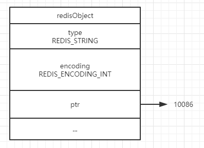
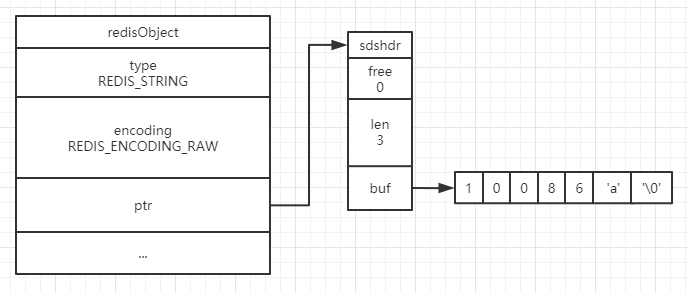
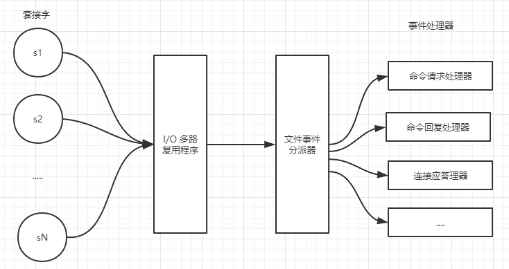

你以为 Redis 这么快仅仅因为单线程和基于内存？

那么你想得太少了，我个人认为 Redis 的快是基于多方面的：不但是单线程和内存，还有底层的数据结构设计，网络通信的设计，主从、哨兵和集群等等方面的设计~

下面，我将 360° 为你揭开 Redis QPS达到10万/秒的神秘面纱。

### 一、底层数据结构设计

#### 1、底层架构：

首先值得称赞的第一点：Redis 底层使用的数据结构很多，但是却没有直接使用这些数据结构来实现键值对数据库，而是基于数据结构创建了一个对象（redisObject）系统。（是不是觉得有点面向对象编程的意思 :joy: ~）

对象系统里面包括了字符串对象，列表对象，哈希对象、集合对象和有序集合对象。

**使用对象的好处：**

- Redis 在执行命令之前，可以根据对象的类型判断这个对象是否可以执行给定的命令。
- 可以针对不用的使用场景，为对象设置多种不同的数据结构实现，从而优化对象在不同场景下的使用效率。

**<font color="red">一个对象怎么设置不同的数据结构实现？</font>**

在讲解前，我们必须要了解 Redis 对象的结构。

它三个重要的部分：type 属性、encoding 属性，和 ptr 属性。

我们用字符串对象为例：

我们都知道，Redis 的 SET 命令其实是针对字符串的，但是它也可以设置数值。那底层是怎么做的呢？

它会将 String 对象的 encoding 属性标识为 REDIS_ENCODING_INT，表示这个键对应的值是 Long 类型的整数。



而当我们利用 APPEND 命令往值后面添加字符串呢？

此时会将 String 对象的 encoding 属性的标识为 REDIS_ENCODING_RAW，表示这个值此时是简单动态字符串。



正是因为使用对象，通过 type、encoding和prt 属性，使得同一个对象可以适应在不同的场景下，使得不同的改变不需要创建新的键值对，这样使得 Redis 的对象使用效率非常的高。

#### 2、灵活的字符串对象

Redis 的字符串对象采用三种编码：int、embstr 和 raw。

int 编码就不用说了，就是为了兼容 SET 命令可以设置数值。

而 embstr 和 raw 最大的区别就是内存分配操作次数：

- embstr 编码专门用于保存短字符串，所以它是通过调用一次内存分配函数来分配一块连续的空间，空间包含 redisObject 和 sdsshdr 两个结构，这样可以很好地利用缓存带来的优势。
- raw 编码则是用于保存长字符串，它通过调用两次内存分配函数来分别创建 redisObject 结构和 sdshdr 结构

#### 3、绝妙的字符串优化策略

Redis 中字符串对象的底层是使用 SDS （Simple Dynamic String）实现的。

SDS 有三部分：

- len：记录 buf 数组中已使用字节的数量，等于 SDS 锁保存字符串的长度

- free：记录 buf 数组中未使用字节的数量

- buf[]：字节数组，用于保存字符串

首先介绍一下使用 len 属性和 free 属性的好处：

得益于 SDS 有 len 属性，获取字符串长度的复杂度为 O(1);

得益于 SDS 有 free 属性，可以杜绝缓冲区溢出，字符串扩展前可以根据 free 属性来判断是否满足直接扩展，不满足则需要先执行内存重分配操作，然后再扩展字符串。

我们都知道修改字符串长度很有可能导致触发内存重分配操作，但是 Redis 对于内存重分配有两个优化策略：

**空间预分配：**

- 空间预分配用于优化 SDS 的字符串增长操作：当 SDS 的API对一个 SDS 进行修改，并且需要对 SDS 进行空间扩展的时候，程序不仅会为 SDS 分配修改所必须要的空间，还会为 SDS 分配额外的未使用空间，并使用 free 属性来记录这些额外分配的字节的数量。

- 通过空间预分配策略，下次字符串扩展时，可以充分利用上次预分配的未使用空间，而不用再触发内存重分配操作了。

**惰性空间释放：**

- 惰性空间释放用于优化 SDS 的字符串缩短操作：当 SDS 的API需要缩短 SDS 保存的字符串时，程序并不立即使用内存重分配来回收缩短后多出来的字节，而是使用上面提到的 free 属性将这些字节的数量记录起来，并等待将来使用。

- 通过惰性空间释放策略，SDS 避免了缩短字符串时所需的内存重分配操作，并为将来可能有的增长操作提供了优化。

#### 4、字符串变量的共享和适配

对象中使用数字是非常常见的，例如设置用户的年龄、学生的分数、博客中文章的排名等等。所以 Redis 为了避免重复创建数字对应的字符串对象，它会将一个范围的整数对应的字符串对象用来共享。

目前来说，Redis 会在初始化服务器时，创建一万个字符串对象，这些对象包含了从 0 到 9999 的所有整数值，当服务器需要用到值为 0 到 9999 的字符串对象时，服务器就会使用这些共享对象，而不是新创建对象。

当然了，我们还可以通过修改 `redis.h/REDIS_SHARED_INTEGERS` 常量来修改创建共享字符串对象的数量。

我们都知道 Redis 是使用 C 语言开发的，所以 SDS 一样遵循 C 字符串以空字符结尾的惯例，所以 SDS 可以重用很多 <string.h> 库定义的函数。

#### 5、强大的压缩列表 ziplist

简单介绍一下 ziplist 的结构：


- zlbytes：记录整个压缩列表占用的内存字节数；在对压缩列表进行内存重分配时，或者计算 zlend 的位置时使用
- zltail：记录压缩列表表尾节点距离压缩列表的起始地址有多少字节；通过这个偏移量，程序无须遍历真个压缩列表就可以确定表尾节点的地址
- zlen：记录了压缩列表包含的节点数量；当这个属性的值大于 UINT16_MAX(65535)时，节点的真实数量需要遍历整个压缩列表才能计算出来。
- entryX：压缩列表的包含的各个节点，节点的长度由节点保存的内容决定。
- zlend：特殊值0XFF（十进制255），用于标记压缩列表的末端。

压缩列表是一种为节约内存而开发的顺序型数据结构，所以在 Redis 里面压缩列表被用做列表键和哈希键的底层实现之一。

- 当一个列表键只包含少量列表项，并且每个列表项要么就是小整数值，要么就是长度比较短的字符串，那么Redis就会使用压缩列表来做列表键的底层实现。
- 当一个哈希键只包含少量键值对，并且每个键值对的键和值要么就是小整数值，要么就是长度比较短的字符串，那么Redis就会使用压缩列表来做哈希键的底层实现。

正是利用压缩列表，不但使得数据非常紧凑而节约内存，而且还可以利用它的结构来做到非常简单的顺序遍历、逆序遍历，O(1) 复杂度的获取长度和所占内存大小等等。

#### 6、整数集合 intset 的升级策略

整数集合（intset）是 Redis 用于保存整数值的集合抽象数据结构，它可以保存类型为 int16_t、int32_t 或者 int64_t 的整数值，并且保证集合中不会出现重复元素。

我们先看看整数集合的结构：

```c
typeof struct intset{
    uint32_t encoding;
    uint32_t length;
    int8_t contents[];
} intset;
```

虽然 intset 结构将 contents 属性声明为 int8_t类型的数组，但实际上 contents 数组并不保存任何 int8_t 类型的值，contents 数组的真正类型取决于 encoding 属性的值。

intset 一开始不会直接使用最大类型来定义数组，而是利用升级操作，当元素的值达到一定长度时，会重新为数组分配内存空间，并将数组里的旧元素的类型进行升级。

这样做好处：

- 避免错误类型，能自适应新添加的新元素的长度。只要是升级了，那么小于对应的长度的数值都可以存进来，而如果长度不足，大不了再升级一次即可。而且，intset 最多就升级两次，不用担心升级次数多而导致性能降低。
- 节约内存，只要当需要时才会进行升级操作，这样可以很好地节省内存。

因为整数集合没有降级操作，所以从另外一个角度看，升级操作其实也会浪费内存：如果整数集合里只有一个数值是 int64_t ，而其他数值都是小于它的，但是整数集合的编码将还是保持 INTSET_ENC_INT64，就是说，小于 int64_t 的整数还是会用 int64_t 的空间来保存。


### 二、单机数据库实现设计

#### 1、Reactor的I/O多路复用

每当别人问 Redis 为啥这么快？吐口而出的不是基于内存就是基于单线程。

Redis 使用基于 Reactor 模式实现的网络通信，它使用 I/O 多路复用（multiplexing）程序来同时监听多个套接字，并根据套接字目前执行的任务来为套接字关联不同的事件处理器。

当被监听的套接字准备好执行连接应答（accept）、读取（read）、写入（write）、关闭（close）等操作时，与操作相对应的文件事件就会产生，这时文件事件分派器就会调用套接字之前关联好的事件处理器来处理这些事件。

因为 Redis 是单线程的，所以I/O多路复用程序会利用队列来控制产生事件的套接字的并发；队列中的套接字以有序、同步、每次一个的方式分派给文件事件分派器。



**多种 I/O 复用机制：**

常见的 I/O 复用机制有很多种，例如 select、epoll、evport 和 kqueue 等等。

Redis 对上面的多种 I/O 复用机制都进行了各自的封装，在程序编译时会自动选择系统中性能最高的 I/O 多路复用函数库来作为 Redis 的 I/O 多路复用程序的底层实现。

#### 2、同步处理的文件事件和时间事件

我们都知道，文件事件的发生都是随机的，因为 Redis 服务器永远不可能知道客户端下次发送命令是什么时候，所以程序也不可能一直阻塞着直到发生文件事件。

毕竟 Redis 是单线程的，文件事件的处理和时间事件的处理都在同一个线程里，如果线程被 `aeApiPoll` 函数一直阻塞着，那么即使时间事件的时间到了，也得不到资源来执行。

所以 Redis 有这么一个策略，`aeApiPoll` 函数的最大阻塞时间由到达时间最接近当前时间的时间事件决定，这个方法既可以避免服务器对时间事件进行频繁的轮询（忙等待），也可以确保 `aeApiPoll` 函数不会阻塞过长时间。

对文件事件和时间事件的处理都是同步、有序、原子地执行的，服务器不会中途中断事件处理，也不会对事件进行抢占，因此，不管是文件事件的处理器，还是时间事件的处理器，它们都会尽可地减少程序的阻塞时间，并在有需要时主动让出执行权，从而降低造成事件饥饿的可能性。

#### 3、当前时间缓存

Redis 服务器中不少功能是要使用系统的当前时间的，而获取系统当前时间需要执行一次系统调用。

为了减少系统调用，提升性能，服务器状态（redisServer）中的 `unixtime` 属性和 `mstime` 属性分别保存了秒级精度的系统当前 UNIX 时间戳和毫秒级精度的系统当前 UNIX 时间戳；然后 serverCron 函数会每隔 100 毫秒更新一次这两个属性。

> 这两个时间只会用在对时间精确度要求不高的功能上，例如打印日志、计算服务器上线时间等等。
> 像设置键过期时间、添加慢查询日志这种需要时间精确度高的功能上，服务器还是会每次都调用系统来获取。


### 三、多机数据库实现设计

#### 1、主从模式 -> 复制算法优化

Redis 2.8 前的复制功能：

- 从服务器向主服务器发送 `SYNC` 命令。
- 主服务器收到 SYNC 命令后，后台生成一个 RDB 文件（BGSAVE），并使用一个缓冲区记录从现在开始执行的所有写命令。
- 当主服务器的 `BGSAVE` 命令执行完毕，将生成的 RDB 文件发送给从服务器；从服务器接收并载入这个 RDB 文件。
- 主服务器将缓冲区里的所有写命令发送给从服务器；从服务器执行这些写命令。
- 至此，主从服务器两者的数据库将达到一致状态。

**缺点：**

假设主从服务器断开连接，当从服务器重新连接上后，又要重新执行一遍同步（sync）操作；但是其实，从服务器重新连接时，数据库状态和主服务器大致是一样的，缺少的只是断开连接过程中，主服务器接收到的写命令；每次断线后都需要重新执行一遍完整的同步操作，这样会很浪费主服务器的性能，毕竟 BGSAVE 命令要读取此时主服务器完整的数据库状态。

<font color="red">Redis 2.8 后对复制算法进行了很大的优化：</font>

利用 `PSYNC` 命令代替 SYNC 命令，将复制操作分为完整重同步和部分重同步。只有当从服务器第一次复制或断开时间过长时，才会执行完整重同步，而从服务器短时间断开重连后，只需要将自己的 offset（复制偏移量）发送给主服务器，主服务器会根据从服务器的 offset 和自己的 offset，然后从**复制积压缓冲区**里将从服务器丢失的写命令发送给从服务器，从服务器只要接收并执行这些写命令，就可以将数据库更新至主服务器当前所处的状态。

#### 2、主从模式 -> 心跳检测

在命令传播阶段，从服务器默认会以每秒一次的频率，向主服务器发送命令：<font color="red">REPLCONF ACK <replication_offset></font>，其中 `replication_offet` 是从服务器当前的复制偏移量。

心跳检测的三大作用：

- 心跳检测不但可以检测主从服务器之间的网络状态。

- 从服务器还会将它的复制偏移量发送给主服务器，让主服务器检查从服务器的命令是否丢失了。

- 心跳检测还能辅助实现 `min-slaves` 配置选项：

```
min-slaves-to-write 3
min-slaves-max-lag 10

解释：那么在从服务器的数量少于3个，或者三个从服务器的延迟（lag）值都大于或等于10秒时，主服务器将拒绝执行写命令，这里的延迟值就是上面提到的INFO replication命令的lag值。
```

#### 3、哨兵模式的订阅连接设计

**Sentinel 不但会与主从服务器建立命令连接，还会建立订阅连接。**

在默认情况下，Sentinel会以每两秒一次的频率，通过**命令连接**向所有被监视的主服务器和从服务器发送 PUBLISH 命令，命令附带的是 Sentinel 本身的信息和所监听的主服务器的信息；接着接收到此命令的主从服务器会向 **\__sentinel__:hello** 频道发送这些信息。

而其他所有都是监听此主从服务器的 Sentinel 可以通过**订阅连接**获取到上面的信息。

<font color="red">这也就是说，对于每个与 Sentinel 的服务器，Sentinel 既通过命令连接向服务器的 **\_\_sentinel\_\_:hello** 频道发送信息（PUBLISH），又通过订阅连接从服务器的 **\_\_sentinel\_\_:hello** 频道接收信息（SUBSCRIBE）。</font>

通过这种方式，监听同一个主服务器的 Sentinel 们可以互相知道彼此的存在，并且可以根据频道消息更新主服务器实例结构（sentinelRedisInstance）的 sentinels 字典，还可借此与其他 Sentinel 建立命令连接，方便之后关于主服务器下线检查、选举领头 Sentinel 等等的通信。

#### 4、集群模式中的 Gossip协议

Redis 集群中的各个节点通过 `Gossip` 协议来交换各自关于不同节点的状态信息，其中 Gossip 协议由 MEET、PING、PONG 三种消息实现，这三种消息的正文都由两个 `cluster.h/clusterMsgDataGossip` 结构组成。

利用 Gossip 协议，可以使得集群中节点更新的信息像病毒一样扩散，这样不但扩散速度快，而且不需要每个节点之间都发送一次消息才能同步集群中最新的信息。


至此，我自己能想到的使得 Redis 性能优越的设计都在这里了。当然了，它的厉害之处远远不止这些~

大家都知道，使用 Redis 是非常简单的，来来去去就几个命令，但是当你深入 Redis 底层的设计和实现，你会发现，这真的是一个非常值得大家深究的开源中间件！！！


参考资料：《Redis 设计与实现》，这是一本写得非常好的书，通俗易懂~