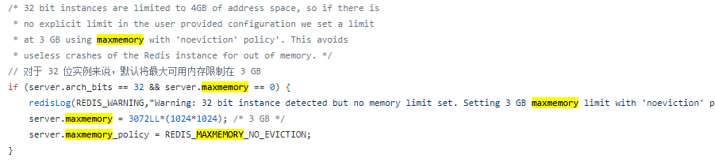
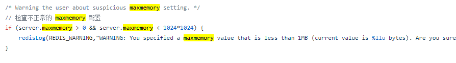
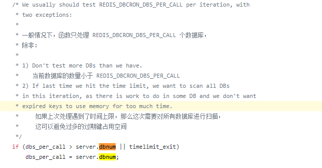

maxmemory：

redis 的 maxmemory 默认是0，即内存使用没有设置最大值

Dan当然了，他也不是完全没有限制，起码对 32位的机器是会限制最大值的

如果用户自己设置了 maxmemory，那么这个值不能小于 1M

dbnum：

redis 默认的数据库数量为 16

redis 不会限制用户要设置数据库的数量。

但是，有很多地方还是会对数据库数量做限制的，所以正常情况下，我们也不要设置过多的数据库数量。

例如过期键的检查：

