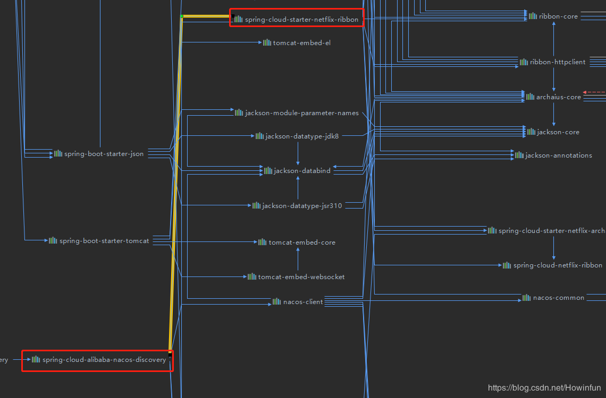
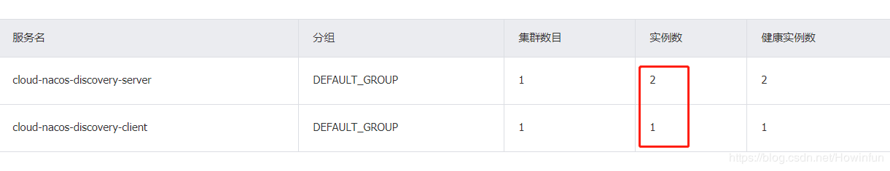
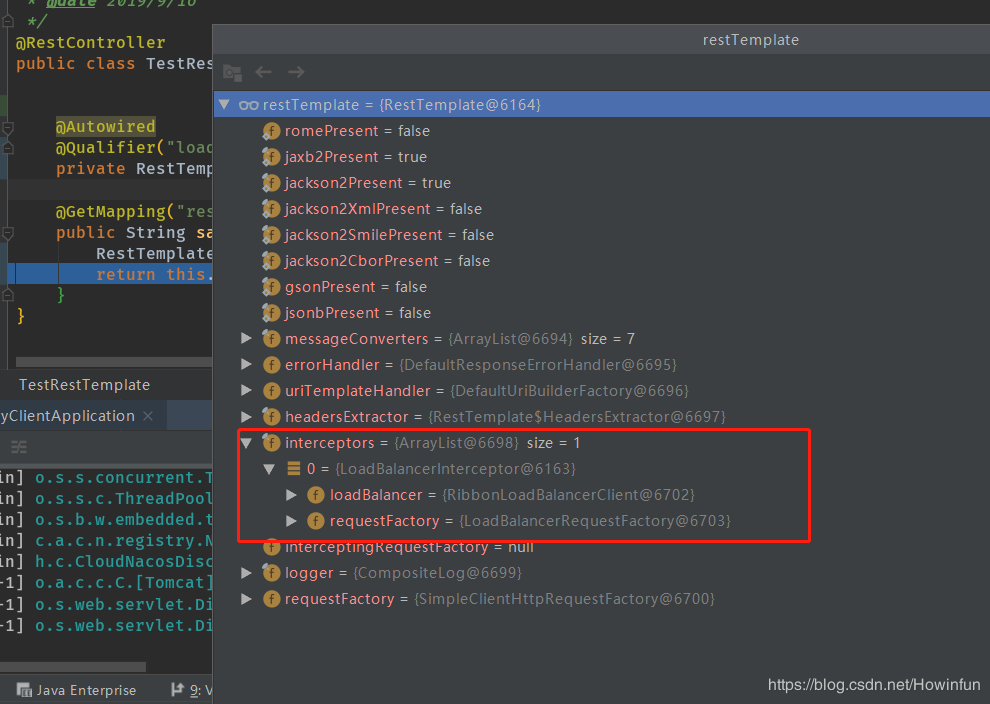
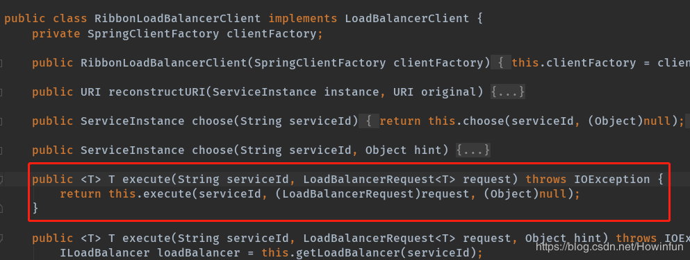
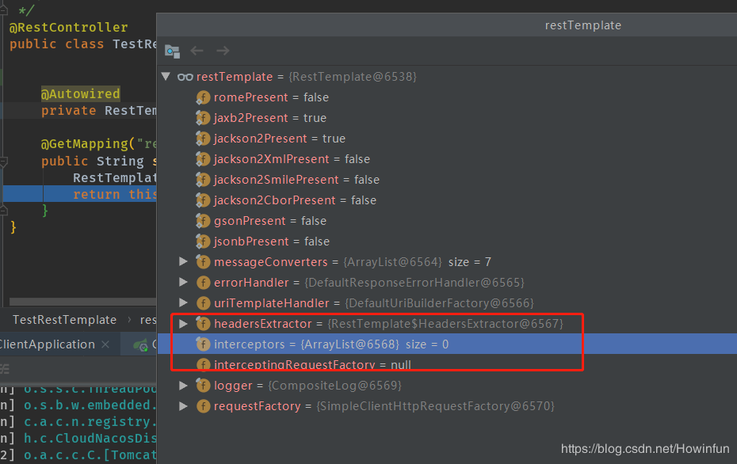
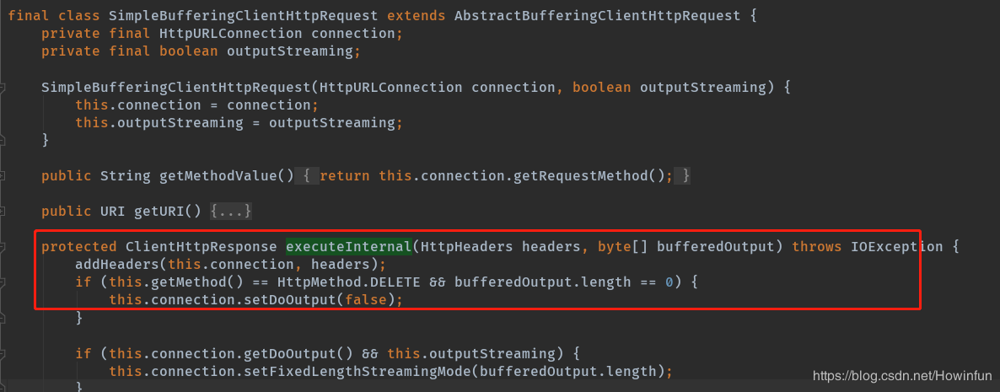

## 前提概要：

前天，有个前端大佬问了我两个问题：为啥不引入`Ribbon`依赖就能使用`Ribbon`？为啥`RestTemplate`加上`@LoadBalanced`注解就能负载均衡了？我也表示很疑惑，而我自己其实也真的没去了解过，所以趁着工作不太忙，赶紧去研究一波。

第一个问题比较简单，一般都是其他依赖引入了`Ribbon`，我这里是`Nacos`，而他那边也是注册中心`Eureka`。


第二个问题由于有一点深度，所以需要好好的研究一番。


## 1、准备：启动两个服务提供者实例，然后启动一个服务消费者实例


## 2、开始搞起来

### 1、准备两个RestTemplate:

一个启动负载均衡，一个不启动负载均衡

```java
@Configuration
public class MyConfiguration {

    // 启动负载均衡
    @LoadBalanced
    @Bean
    RestTemplate loadBalanced() {
        return new RestTemplate();
    }

    // 不启动负载均衡
    @Bean
    RestTemplate restTemplate() {
        return new RestTemplate();
    }
}
```


### 2、负载均衡探索：

```java
@Autowired
private RestTemplate loadBalanced;

@GetMapping("restTemplate-hello")
public String sayHello(){
    return loadBalanced.getForObject("http://cloud-nacos-discovery-server/hello",String.class);
}
```

<font color="red">注意：使用负载均衡的`RestTemplate`去请求时url一定得写服务名，因为`Ribbon`会根据服务名`[serviceId]`去获取所有实例，然后进行负载均衡。所以记得不能写`IP:Port`，不然会报错。</font>

```java
java.lang.IllegalStateException: No instances available for 10.172.29.666
```


#### (1)、为何带上@LoadBalanced就能负载均衡？

之所以标记了`@LoadBalanced`的`RestTemplate`会带有负载均衡的功能，是因为`RestTemplate`里面加入`LoadBalancerInterceptor`拦截器。我们也可以看到，我们上面的代码使用的`loadBalanced`确实有`LoadBalancerInterceptor`拦截器。



#### (2)、拦截器是如何进行负载均衡的？

`RestTemplate`的每次请求都会被此拦截，然后利用`Ribbon`实现负载均衡逻辑。

```java
public ClientHttpResponse intercept(final HttpRequest request, final byte[] body, final ClientHttpRequestExecution execution) throws IOException {
        URI originalUri = request.getURI();
        String serviceName = originalUri.getHost();
        Assert.state(serviceName != null, "Request URI does not contain a valid hostname: " + originalUri);
      //这里是使用负载均衡，而这里的loadBalancer就是Spring Cloud提供的LoadBalancerClient接口的实现类。
        return (ClientHttpResponse)this.loadBalancer.execute(serviceName, this.requestFactory.createRequest(request, body, execution));
    }
```

我们也看到，最后是通过`(ClientHttpResponse)this.loadBalancer.execute(serviceName, this.requestFactory.createRequest(request, body, execution))`去负载均衡的，而从上图我们也可以看到，我们`RestTemplate`的`loadBanalcer`是`RibbonLoadBalancerClient`，所以说，最后是通过`Ribbon`是负载均衡的。



#### (3)、那究竟是谁帮RestTemplate加上这个拦截器的？而且是什么时候加的？

##### ① LoadBalancerAutoConfiguration配置类

关于`@LoadBalanced `自动生效的配置，我们需要来到这个自动配置类：`LoadBalancerAutoConfiguration`。

我们可以看到这个配置类上有俩个注解：`@ConditionalOnClass({RestTemplate.class})`，`@ConditionalOnBean({LoadBalancerClient.class})`，意思是说：只要有`RestTemplate`类存在，并且`Spring`容器中存在`LoadBalancerClient`类型的Bean，这个配置类才会生效。首先，`Spring`的`web`模块已经提供了`RestTemplate`类，而`Ribbon`也提供了实现`LoadBalancerClient`接口的实现类，所以说上面所有的条件都符合了，该配置类会生效。

```java
@Configuration
@ConditionalOnClass({RestTemplate.class})
@ConditionalOnBean({LoadBalancerClient.class})
@EnableConfigurationProperties({LoadBalancerRetryProperties.class})
public class LoadBalancerAutoConfiguration {
```

##### ② 一个关键的成员变量

我们可以看到`LoadBalancerAutoConfiguration`中有一个成员变量：

```java
//拿到Spring容器内所有的标注有@LoadBalanced注解的RestTemplate们。 注意：是带有@LoadBalanced注解的
@LoadBalanced
@Autowired(required = false)
private List<RestTemplate> restTemplates = Collections.emptyList();
```

##### ③ RestTemplateCustomizer来加拦截器

我们会先找拦截器相关的代码，因为此时我们都知道负载均衡主要靠的是拦截器，所以，上代码：

```java
@Bean
@ConditionalOnMissingBean
public RestTemplateCustomizer restTemplateCustomizer(final LoadBalancerInterceptor loadBalancerInterceptor) {
    return (restTemplate) -> {
        // 我们可以看到，如果我们没有自己实现`RestTemplateCustomizer`，就会执行下面的逻辑，而最突兀的就是，它给每一个`RestTemplate`添加了`LoadBalancerInterceptor`，也就是实现负载均衡的重点所在。
        List<ClientHttpRequestInterceptor> list = new ArrayList(restTemplate.getInterceptors());
        list.add(loadBalancerInterceptor);
        restTemplate.setInterceptors(list);
    };
}
```

##### ④ 何时利用RestTemplateCustomizer来给RestTemplate加拦截器

还有另外一段很重要的代码，需要来解读一下：

首先我们得先了解`SmartInitializingSingleton`是干嘛的，它的`afterSingletonsInstantiated()`方法会在所有的单例Bean初始化完成之后，再去一个一个的去处理。

```java
public interface SmartInitializingSingleton {
    void afterSingletonsInstantiated();
}
```

那么我们就知道了，接下来要解读的代码就是为了处理一个个带有`@LoadBalanced`的`RestTemplate`们，利用`RestTemplateCustomizer`给`RestTemplate`们加上拦截器`LoadBalancerInterceptor`。

```java
@Bean
public SmartInitializingSingleton loadBalancedRestTemplateInitializerDeprecated(final ObjectProvider<List<RestTemplateCustomizer>> restTemplateCustomizers) {
    return () -> {
        restTemplateCustomizers.ifAvailable((customizers) -> {
            // 遍历上面提及的成员变量，带@LoadBalanced的RestTemplate们
            Iterator var2 = this.restTemplates.iterator();

            while(var2.hasNext()) {
                RestTemplate restTemplate = (RestTemplate)var2.next();
                Iterator var4 = customizers.iterator();

                while(var4.hasNext()) {
                    // 利用上面的RestTemplateCustomizer给RestTemplate们加拦截器
                    RestTemplateCustomizer customizer = (RestTemplateCustomizer)var4.next();
                    customizer.customize(restTemplate);
                }
            }

        });
    };
}
```

所以最后，我们可以给第三个问题一个答案：**在带有`@LoadBalanced`注解的`RestTemplate`们完成Bean初始化之后，利用`RestTemplateCustomizer`给`RestTemplate`们加上拦截器`LoadBalancerInterceptor`，来实现负载均衡。**


### 3、非负载均衡探索

```java
@Autowrite
private RestTemplate restTemplate;

@GetMapping("restTemplate-hello")
public String sayHello(){
    return myRestTemplate.getForObject("http://10.172.29.666:8887/hello",String.class);
}
```

首先可以看到，RestTemplate不再带有拦截器

而且，我们可以看到，最后接口走的是`SimpleBufferingClientHttpRequest`，而不是`RibbonLoadBalancerClient`：


到此，关于为什么添加了`@LoadBalanced`就能进行负载均衡的分析已经结束。而如果大家对`Ribbon`如何进行负载均衡的也很感兴趣，有空再大家一起研究研究😄。