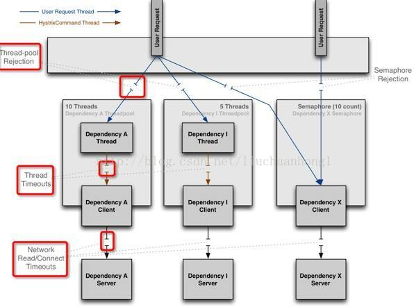

## 关于Feign的超时详解：

在Spring Cloud微服务架构中，大部分公司都是利用Open Feign进行服务间的调用，而比较简单的业务使用默认配置是不会有多大问题的，但是如果是业务比较复杂，服务要进行比较繁杂的业务计算，那后台很有可能会出现Read Timeout这个异常。

### 1、关于hystrix的熔断超时

如果Feign开启了熔断，必须要重新设置熔断超时的时间，因为默认的熔断超时时间太短了，只有1秒，这容易导致业务服务的调用还没完成然后超时就被熔断了。

如何配置熔断超时：

```properties
#Feign如何开启熔断 Feigin默认不开启 hystrix 熔断
feign.hystrix.enabled=true

#是否开始超时熔断，如果为false，则熔断机制只在服务不可用时开启（spring-cloud-starter-openfeign中的HystrixCommandProperties默认为true）
hystrix.command.default.execution.timeout.enabled=true

#设置超时熔断时间（spring-cloud-starter-openfeign中的HystrixCommandProperties默认为1000毫秒）
hystrix.command.default.execution.isolation.thread.timeoutInMilliseconds=6000
```

<font color="red">**注意：关于hystrix在application.properties配置是没提示的，但是HystrixCommandProperties是会获取的。**</font>

```java
// 构造函数
protected HystrixCommandProperties(HystrixCommandKey key, HystrixCommandProperties.Setter builder, String propertyPrefix) {
        
    	// .... 省略很多其他配置
    
    	// propertyPrefix：hystrix，key：default
        this.executionTimeoutInMilliseconds = getProperty(propertyPrefix, key, "execution.isolation.thread.timeoutInMilliseconds", builder.getExecutionIsolationThreadTimeoutInMilliseconds(), default_executionTimeoutInMilliseconds);
    }

// 具体获取属性的方法
private static HystrixProperty<String> getProperty(String propertyPrefix, HystrixCommandKey key, String instanceProperty, String builderOverrideValue, String defaultValue) {
        return HystrixPropertiesChainedProperty.forString().add(propertyPrefix + ".command." + key.name() + "." + instanceProperty, builderOverrideValue).add(propertyPrefix + ".command.default." + instanceProperty, defaultValue).build();
    }
```

### 2、Feign 配置超时时间

```properties
# 如果 config 后面跟着的是
feign.client.config.default.connect-timeout=3000
feign.client.config.default.read-timeout=3000
```


### 2、关于Ribbon超时。

Feign调用默认是使用Ribbon进行负载均衡的，所以我们还需要了解关于Ribbon的超时。

首先看一下使用Feign的调用链路，看一下Feign的请求是否有使用Ribbon的超时时间，而且是如何读取Ribbon的超时时间的？

1、org.springframework.cloud.openfeign.ribbon.LoadBalancerFeignClient#execute

2、com.netflix.client.AbstractLoadBalancerAwareClient#executeWithLoadBalancer(S, com.netflix.client.config.IClientConfig)

3、org.springframework.cloud.openfeign.ribbon.CachingSpringLoadBalancerFactory#create

​	创建Client，这里会判断对应ClientName的链接Client是否创建过，如果创建过复用之前的Client；如果不存在则创建一个并且放入cache缓存。

```java
public FeignLoadBalancer create(String clientName) {
		FeignLoadBalancer client = this.cache.get(clientName);
		if(client != null) {
			return client;
		}
		IClientConfig config = this.factory.getClientConfig(clientName);
		ILoadBalancer lb = this.factory.getLoadBalancer(clientName);
		ServerIntrospector serverIntrospector = this.factory.getInstance(clientName, ServerIntrospector.class);
    	// 判断是否有重试
		client = loadBalancedRetryFactory != null ? new RetryableFeignLoadBalancer(lb, config, serverIntrospector,
			loadBalancedRetryFactory) : new FeignLoadBalancer(lb, config, serverIntrospector);
		this.cache.put(clientName, client);
		return client;
	}
```

4、com.netflix.client.AbstractLoadBalancerAwareClient#executeWithLoadBalancer(S, com.netflix.client.config.IClientConfig)

​	负载均衡器抽象类

5、org.springframework.cloud.openfeign.ribbon.FeignLoadBalancer#execute

​	Feign的负载均衡器实现类。到这里我们可以看到，连接超时和读超时的配置都在这里：如果application.properties配置文件中的超时时间不为空，则使用配置的超时时间。如果为空则使用默认值，而从FeignLoadBalancer的构造函数可以看到，默认值也是取的RibbonProperties的默认超时时间。

```java
public RibbonResponse execute(RibbonRequest request, IClientConfig configOverride)
			throws IOException {
    Request.Options options;
    // 设置超时时间。，如果orride的配置为空，则用默认值
    if (configOverride != null) {
        RibbonProperties override = RibbonProperties.from(configOverride);
        options = new Request.Options(
            override.connectTimeout(this.connectTimeout),
            override.readTimeout(this.readTimeout));
    }
    else {
        options = new Request.Options(this.connectTimeout, this.readTimeout);
    }
    // 发起请求
    Response response = request.client().execute(request.toRequest(), options);
    return new RibbonResponse(request.getUri(), response);
}

// 构造函数
public FeignLoadBalancer(ILoadBalancer lb, IClientConfig clientConfig, ServerIntrospector serverIntrospector) {
        super(lb, clientConfig);
        this.setRetryHandler(RetryHandler.DEFAULT);
        this.clientConfig = clientConfig;
        this.ribbon = RibbonProperties.from(clientConfig);
        RibbonProperties ribbon = this.ribbon;
        this.connectTimeout = ribbon.getConnectTimeout();
        this.readTimeout = ribbon.getReadTimeout();
        this.serverIntrospector = serverIntrospector;
    }
```

首先，我们看一下Ribbon的默认超时时间

在`RibbonClientConfiguration`中：

```java
public static final int DEFAULT_CONNECT_TIMEOUT = 1000;
public static final int DEFAULT_READ_TIMEOUT = 1000;
```

那么，如果我们想自己配置Ribbon的超时时间，该么配置呢？

首先，

RibbonProperties的读取配置的源码如下：

```java
public Integer getConnectTimeout() {
    return (Integer)this.get(CommonClientConfigKey.ConnectTimeout);
}

public Integer getReadTimeout() {
    return (Integer)this.get(CommonClientConfigKey.ReadTimeout);
}
```

在`CommonClientConfigKey`中可以看到两个超时时间的名称：

```java
// ConnectTimeout:
public static final IClientConfigKey<Integer> ConnectTimeout = new CommonClientConfigKey<Integer>("ConnectTimeout") {};

// ReadTimeout:
public static final IClientConfigKey<Integer> ReadTimeout = new CommonClientConfigKey<Integer>("ReadTimeout") {};
```

然后在IClientConfig的默认实现类：DefaultClientConfigImpl中，可以发现ribbon配置的前缀

```java
public static final String DEFAULT_PROPERTY_NAME_SPACE = "ribbon";
```

所以，最后Ribbon该这么配置超时时间：

```properties
ribbon.ConnectTimeout=5000
ribbon.ReadTimeout=5000
```

6、Feign默认的client：feign.Client.Default

7、feign.Client.Default#execute，http请求使用的是HttpURLConnection。


### 3、更换Http请求框架：

> 在 openFeign 中，hystrix 的默认隔离策略为线程池（THREAD）

更换Apache HttpClient框架：feign.httpclient.ApacheHttpClient

org.springframework.cloud.openfeign.FeignAutoConfiguration.HttpClientFeignConfiguration

```java
@Configuration
	@ConditionalOnClass(ApacheHttpClient.class)
	@ConditionalOnMissingClass("com.netflix.loadbalancer.ILoadBalancer")
	@ConditionalOnMissingBean(CloseableHttpClient.class)
	@ConditionalOnProperty(value = "feign.httpclient.enabled", matchIfMissing = true)
	protected static class HttpClientFeignConfiguration {
		private final Timer connectionManagerTimer = new Timer(
				"FeignApacheHttpClientConfiguration.connectionManagerTimer", true);

		@Autowired(required = false)
		private RegistryBuilder registryBuilder;

		private CloseableHttpClient httpClient;

		@Bean
		@ConditionalOnMissingBean(HttpClientConnectionManager.class)
		public HttpClientConnectionManager connectionManager(
				ApacheHttpClientConnectionManagerFactory connectionManagerFactory,
				FeignHttpClientProperties httpClientProperties) {
			final HttpClientConnectionManager connectionManager = connectionManagerFactory
					.newConnectionManager(httpClientProperties.isDisableSslValidation(), httpClientProperties.getMaxConnections(),
							httpClientProperties.getMaxConnectionsPerRoute(),
							httpClientProperties.getTimeToLive(),
							httpClientProperties.getTimeToLiveUnit(), registryBuilder);
			this.connectionManagerTimer.schedule(new TimerTask() {
				@Override
				public void run() {
					connectionManager.closeExpiredConnections();
				}
			}, 30000, httpClientProperties.getConnectionTimerRepeat());
			return connectionManager;
		}

		@Bean
		public CloseableHttpClient httpClient(ApacheHttpClientFactory httpClientFactory,
				HttpClientConnectionManager httpClientConnectionManager,
				FeignHttpClientProperties httpClientProperties) {
			RequestConfig defaultRequestConfig = RequestConfig.custom()
					.setConnectTimeout(httpClientProperties.getConnectionTimeout())
					.setRedirectsEnabled(httpClientProperties.isFollowRedirects())
					.build();
			this.httpClient = httpClientFactory.createBuilder().
					setConnectionManager(httpClientConnectionManager).
					setDefaultRequestConfig(defaultRequestConfig).build();
			return this.httpClient;
		}

		@Bean
		@ConditionalOnMissingBean(Client.class)
		public Client feignClient(HttpClient httpClient) {
			return new ApacheHttpClient(httpClient);
		}

		@PreDestroy
		public void destroy() throws Exception {
			connectionManagerTimer.cancel();
			if(httpClient != null) {
				httpClient.close();
			}
		}
	}
```

引入依赖：

```xml
<dependency>
    <groupId>io.github.openfeign</groupId>
    <artifactId>feign-httpclient</artifactId>
    <version>9.4.0</version>
</dependency>
```

增加配置：

```properties
feign.httpclient.enabled=true
```


更换为OkHttp：feign.okhttp.OkHttpClient

org.springframework.cloud.openfeign.FeignAutoConfiguration.OkHttpFeignConfiguration

```java
@Configuration
	@ConditionalOnClass(OkHttpClient.class)
	@ConditionalOnMissingClass("com.netflix.loadbalancer.ILoadBalancer")
	@ConditionalOnMissingBean(okhttp3.OkHttpClient.class)
	@ConditionalOnProperty(value = "feign.okhttp.enabled")
	protected static class OkHttpFeignConfiguration {

		private okhttp3.OkHttpClient okHttpClient;

		@Bean
		@ConditionalOnMissingBean(ConnectionPool.class)
		public ConnectionPool httpClientConnectionPool(FeignHttpClientProperties httpClientProperties,
													   OkHttpClientConnectionPoolFactory connectionPoolFactory) {
			Integer maxTotalConnections = httpClientProperties.getMaxConnections();
			Long timeToLive = httpClientProperties.getTimeToLive();
			TimeUnit ttlUnit = httpClientProperties.getTimeToLiveUnit();
			return connectionPoolFactory.create(maxTotalConnections, timeToLive, ttlUnit);
		}

		@Bean
		public okhttp3.OkHttpClient client(OkHttpClientFactory httpClientFactory,
										   ConnectionPool connectionPool, FeignHttpClientProperties httpClientProperties) {
			Boolean followRedirects = httpClientProperties.isFollowRedirects();
			Integer connectTimeout = httpClientProperties.getConnectionTimeout();
			Boolean disableSslValidation = httpClientProperties.isDisableSslValidation();
			this.okHttpClient = httpClientFactory.createBuilder(disableSslValidation).
					connectTimeout(connectTimeout, TimeUnit.MILLISECONDS).
					followRedirects(followRedirects).
					connectionPool(connectionPool).build();
			return this.okHttpClient;
		}

		@PreDestroy
		public void destroy() {
			if(okHttpClient != null) {
				okHttpClient.dispatcher().executorService().shutdown();
				okHttpClient.connectionPool().evictAll();
			}
		}

		@Bean
		@ConditionalOnMissingBean(Client.class)
		public Client feignClient(okhttp3.OkHttpClient client) {
			return new OkHttpClient(client);
		}
	}
```

引入依赖：

```xml
<dependency>
    <groupId>io.github.openfeign</groupId>
    <artifactId>feign-okhttp</artifactId>
    <version>10.2.0</version>
</dependency>
```

增加配置：

```properties
feign.okhttp.enabled=true
```


#### Ribbon的饥饿加载:

主要是Ribbon进行客户端负载均衡的Client并不是在服务启动的时候就初始化好的，而是在调用的时候才会去创建相应的Client，所以第一次调用的耗时不仅仅包含发送HTTP请求的时间，还包含了创建RibbonClient的时间，这样一来如果创建时间速度较慢，同时设置的超时时间又比较短的话，很容易就会出现上面所描述的显现。

```properties
ribbon.eager-load.enabled : 开启Ribbon的饥饿加载模式
ribbon.eager-load.clients: 指定需要饥饿加载的服务名
```


### 关于服务间调用传递请求头Token

**方法一**

```java
/**
 * @author Howinfun
 * @desc
 * @date 2019/12/2
 */
@FeignClient(value = "mcmc-thirdPartyApi",contextId = "mcmc-thirdPartyApi-OrderFeignClient",fallbackFactory = OrderFeignClientFallBackFactory.class)
public interface OrderFeignClient {

    /**
     * 创建订单
     * @param map
     * @return
     */
    @PostMapping("/order/addOrder")
    Result addOrder(@RequestBody Map<String, Object> map,@RequestHeader(name = "Authorization",required = true) String token);
}
```

```java
/**
 * @author Howinfun
 * @desc
 * @date 2019/12/2
 */
@Service
public class chargeServiceImpl implements chargeService{
	
    @Resource
    private OrderFeignClient orderFeignClient;
    
    /**
     * 创建订单
     * @param map
     * @return
     */
    @PostMapping("/order/addOrder")
    Result addOrder(@RequestBody Map<String, Object> map,String token){
        this.orderFeignClient(map,token);
    }
}
```

**方法二**

参考文章：https://blog.csdn.net/zhouyuhhu/article/details/103719825

新建Configuration

```java
/**
 * @author Howinfun
 * @desc Feign调用的时候添加请求头Token
 * @date 2019/12/2
 */
@Configuration
public class FeignConfiguration implements RequestInterceptor {
 
    @Override
    public void apply(RequestTemplate requestTemplate) {
        ServletRequestAttributes attributes = (ServletRequestAttributes) RequestContextHolder.getRequestAttributes();
        HttpServletRequest request = attributes.getRequest();
        requestTemplate.header("Authorization", request.getHeader("Authorization"));
    }
}
```

FeignClient指定Configuration

```java
/**
 * @author Howinfun
 * @desc
 * @date 2019/12/2
 */
@FeignClient(value = "mcmc-thirdPartyApi",contextId = "mcmc-thirdPartyApi-OrderFeignClient",fallbackFactory = OrderFeignClientFallBackFactory.class,configuration=FeignConfiguration.class)
public interface OrderFeignClient {

    /**
     * 创建订单
     * @param map
     * @return
     */
    @PostMapping("/order/addOrder")
    Result addOrder(@RequestBody Map<String, Object> map,@RequestHeader(name = "Authorization",required = true) String token);
}
```

配置文件新增配置：
将 hystrix 的隔离策略改为信号量（semaphore），默认为线程池（Thread）。

```yaml
hystrix:
  command:
    default:
      execution:
        isolation:
          strategy: SEMAPHORE
```

```properties
hystrix.command.default.execution.isolation.strategy= SEMAPHORE
```

如果 hystrix 使用线程池管理请求的话，从主线程到发送基于 hystrix 的feign请求，已经是两个线程了。

用户发起请求是一条线程，而基于 hystrix 和 openfeign 是另起一条线程发起 http 请求别的服务的，而使用 RequestContextHolder.getRequestAttributes() 其实利用 ThreadLocal 来获取当前线程里的请求的配置的。

所以如果需要使用这个方法来获取用户请求的token，需要将隔离策略改为信号量。

```java
private static final ThreadLocal<RequestAttributes> requestAttributesHolder = new NamedThreadLocal("Request attributes");


@Nullable
public static RequestAttributes getRequestAttributes() {
    RequestAttributes attributes = (RequestAttributes)requestAttributesHolder.get();
    if (attributes == null) {
        attributes = (RequestAttributes)inheritableRequestAttributesHolder.get();
    }

    return attributes;
}
```


#### 两种隔离策略详解

##### 一、示意图：

左侧2/3是线程池资源隔离示意图，右侧1/3是信号量资源隔离示意图。




##### 二、线程池隔离策略：

不同服务通过使用不同线程池，彼此间将不受影响，达到隔离效果。

**例子：**

当用户请求服务A和服务I的时候，tomcat的线程(图中蓝色箭头标注)会将请求的任务交给服务A和服务I的内部线程池里面的线程(图中橘色箭头标注)来执行，tomcat的线程就可以去干别的事情去了，当服务A和服务I自己线程池里面的线程执行完任务之后，就会将调用的结果返回给tomcat的线程，从而实现资源的隔离，当有大量并发的时候，服务内部的线程池的数量就决定了整个服务的并发度，例如服务A的线程池大小为10个，当同时有12请求时，只会允许10个任务在执行，其他的任务被放在线程池队列中，或者是直接走降级服务，此时，如果服务A挂了，就不会造成大量的tomcat线程被服务A拖死，服务I依然能够提供服务。整个系统不会受太大的影响。

##### 三、信号量隔离策略：

线程隔离会带来线程开销，有些场景（比如无网络请求场景）可能会因为用开销换隔离得不偿失，为此hystrix提供了信号量隔离，当服务的并发数大于信号量阈值时将进入fallback。

**例子：**

信号量的资源隔离只是起到一个开关的作用，例如，服务X的信号量大小为10，那么同时只允许10个tomcat的线程(此处是tomcat的线程，而不是服务X的独立线程池里面的线程)来访问服务X，其他的请求就会被拒绝，从而达到限流保护的作用。

##### 四、两者的比较

|          | 线程池隔离               | 信号量隔离                                          |
| -------- | ------------------------ | --------------------------------------------------- |
| 线程     | 与调用线程非相同线程     | 与调用线程相同（容器的线程，如tomcat、jetty的线程） |
| 开销     | 排队、调度、上下文开销等 | 无线程切换，开销低                                  |
| 异步     | 支持                     | 不支持                                              |
| 并发支持 | 支持（最大线程池大小）   | 支持（最大信号量上限）                              |


