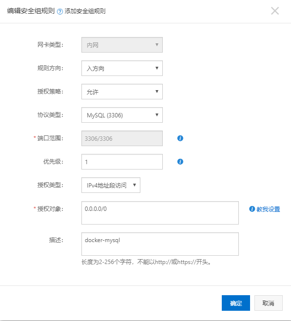
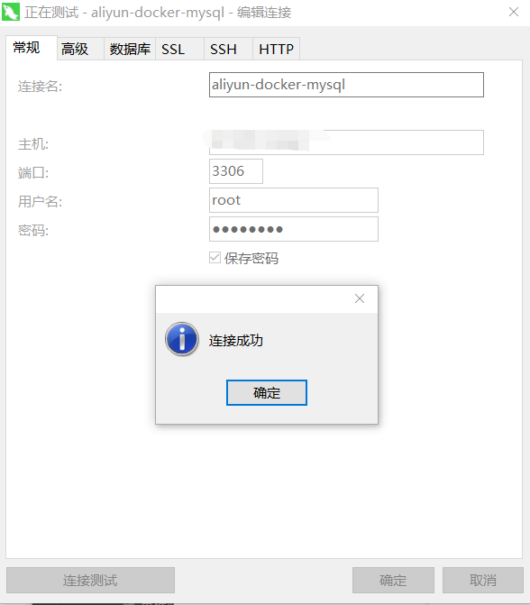

#### Docker 安装 Mysql
##### 1、从镜像源中pull Mysql的镜像，我拉的版本是5.6，大家可不带版本拉最新的。
```sh
[root@izwz90lvzs7171wgdhul8az ~]# docker pull mysql:5.6
5.6: Pulling from library/mysql
8f91359f1fff: Pull complete 
6bbb1c853362: Pull complete 
e6e554c0af6f: Pull complete 
f391c1a77330: Pull complete 
414a8a88eabc: Pull complete 
ced966b42b0e: Pull complete 
509b7d623b06: Pull complete 
94a03dec9143: Pull complete 
d40a4af51b78: Pull complete 
e01756c8536e: Pull complete 
327b60c1a0e5: Pull complete 
Digest: sha256:07ebe49dc810444e172c2b5a72ae1a23ad9f4942bfe70a7f0a578590da610579
Status: Downloaded newer image for mysql:5.6
docker.io/library/mysql:5.6
```
等待下载完成后，我们就可以在本地镜像列表里查到REPOSITORY为mysql,标签为5.6的镜像。
```
[root@izwz90lvzs7171wgdhul8az ~]# docker images | grep mysql
mysql               5.6                 95e0fc47b096        3 weeks ago         257MB
```

##### 2、使用Mysql镜像运行容器。
```
[root@izwz90lvzs7171wgdhul8az ~]# docker run -p 3306:3306 --name mymysql -v $PWD/conf:/etc/mysql/conf.d -v $PWD/logs:/logs -v $PWD/data:/var/lib/mysql -e MYSQL_ROOT_PASSWORD=123456 -d mysql:5.6
64bc48daaa60a66262a3356d7027e5dad12b903ad7433b79138dae4b5b1eb98e
```
命令说明：
- -p 3306:3306：将容器的 3306 端口映射到主机的 3306 端口。

- -v $PWD/conf:/etc/mysql/conf.d：将主机当前目录下的 conf/my.cnf 挂载到容器的 /etc/mysql/my.cnf。

- -v $PWD/logs:/logs：将主机当前目录下的 logs 目录挂载到容器的 /logs。

- -v $PWD/data:/var/lib/mysql ：将主机当前目录下的data目录挂载到容器的 /var/lib/mysql 。

- -e MYSQL_ROOT_PASSWORD=123456：初始化 root 用户的密码。

##### 3、查看容器启动情况。
```
[root@izwz90lvzs7171wgdhul8az ~]# docker ps
CONTAINER ID        IMAGE               COMMAND                  CREATED             STATUS              PORTS                    NAMES
64bc48daaa60        mysql:5.6           "docker-entrypoint.s??   3 seconds ago       Up 1 second         0.0.0.0:3306->3306/tcp   mymysql
```
##### 4、使用Navicat链接Mysql。
**注意：如果我们使用的是阿里云等云服务器的，要注意是否需要添加安全组规则。**

可以看到，连接是没问题的：

