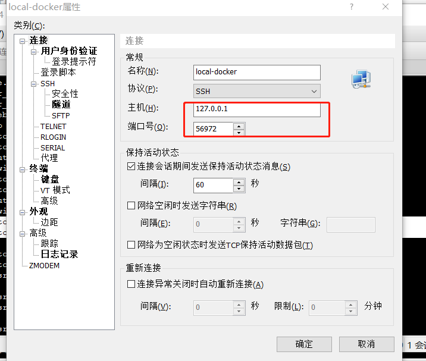
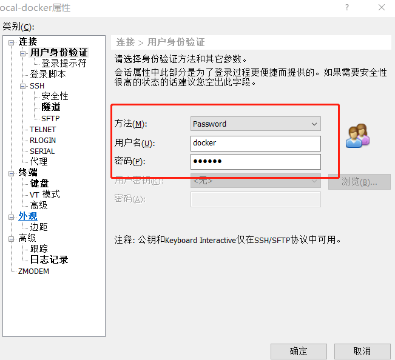
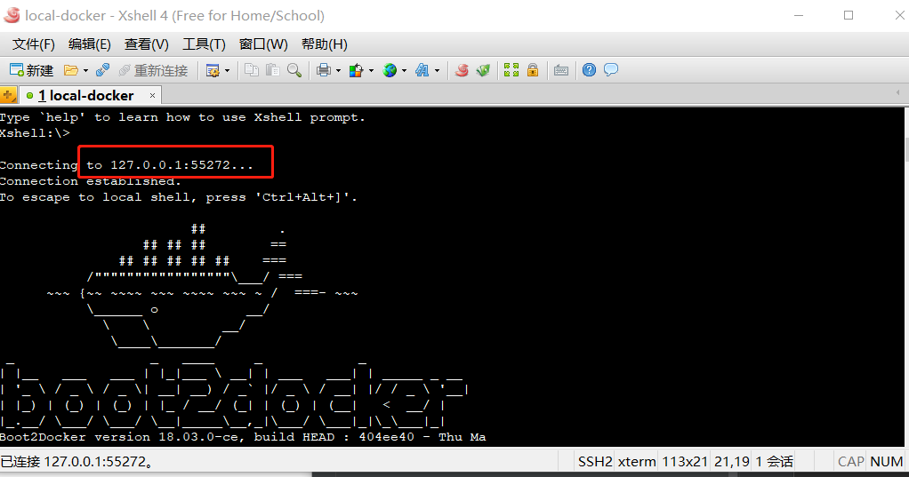
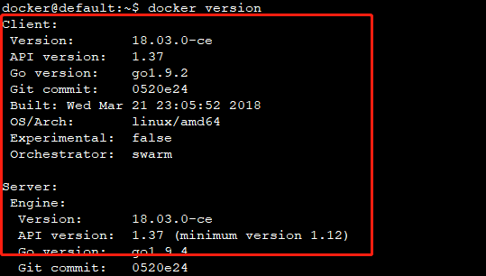

平时我们可以使用Xhell来连接Docker虚拟机。
1、首先，我们来用VirtualBox管理器来看一下default虚拟机的网络配置：

2、新建Xshell会话：

a.我们可以看到ssh的主机IP为127.0.0.1，端口号为55272

b.然后虚拟机有一个默认的帐号docker，密码为tcuser。

3、当连接成功后，我们又看到可熟悉的小鲸鱼了。

4、我们尝试一下简单的命令 docker info，看看到底行不行：
