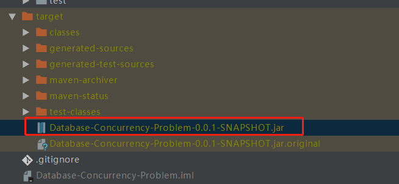
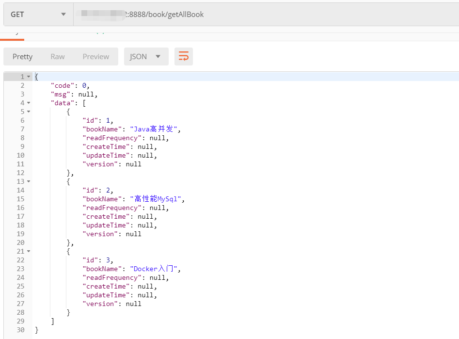

1、创建一个SpringBooot项目并且打成jar包

2、在Linux中创建一个文件夹，来做docker测试
```
[root@izwz90lvzs7171wgdhul8az ~]# mkdir /root/docker_test
```
3、将jar包上传到Linux中
创建存放jar包的文件夹
```
[root@izwz90lvzs7171wgdhul8az docker_test]# mkdir /root/docker_test/jar
```
然后利用XShell上传jar包到上面的文件夹中

4、编写Dockerfile文件
```
# 基于java镜像创建新镜像
FROM java:8
# 作者
MAINTAINER Howinfun
# 将jar包添加到容器中并更名为app.jar
ADD  jar/app.jar /root/docker_test/app.jar
# 运行jar包
ENTRYPOINT ["nohup","java","-jar","/root/docker_test/app.jar","&"]
```
注意：ADD 、 COPY 指令用法一样，唯一不同的是 ADD 支持将归档文件（tar, gzip, bzip2, etc）做提取和解压操作。注意的是，COPY 指令需要复制的目录一定要放在 Dockerfile 文件的同级目录下。
5、制作镜像
```
[root@izwz90lvzs7171wgdhul8az docker_test]# docker build -t sbdemo .
```
命令参数：
- -t：指定新镜像名
- .：表示Dockfile在当前路径
如果我们的 Dockerfile 文件路径不在这个目录下，或者有另外的文件名，我们可以通过 -f 选项单独给出 Dockerfile 文件的路径
```
[root@izwz90lvzs7171wgdhul8az docker_test]# docker build -t sbdemo2 -f /root/docker_test/Dockerfile /root/docker_test/
```
命令参数：
- -f：第一个参数是Dockerfile的路径 第二个参数是Dockerfile所在文件夹
制作完成后通过docker images命令查看我们制作的镜像：
```
[root@izwz90lvzs7171wgdhul8az  docker_test]# docker images | grep sbdemo
sbdemo              latest              7efac46ef997        4 hours ago         686MB
```

6、启动容器
```
[root@izwz90lvzs7171wgdhul8az docker_test]# docker run -d -p 8888:8888 --name mysbdemo sbdemo:latest
```
命令参数：
- -d：后台运行
- -p：公开指定端口号
- --name：给容器命名
启动后可通过docker ps查看正在运行的容器：
```
[root@izwz90lvzs7171wgdhul8az docker_test]# docker ps
CONTAINER ID        IMAGE               COMMAND                  CREATED             STATUS              PORTS                    NAMES
5096c8c7b36f        sbdemo              "nohup java -jar /ro??   4 seconds ago       Up 2 seconds        0.0.0.0:8888->8888/tcp   mysbdemo
```
7、查看容器启动日志
我们可以通过 docker logs 查看指定容器的日志：
```
[root@izwz90lvzs7171wgdhul8az docker_test]# docker logs mysbdemo

  .   ____          _            __ _ _
 /\\ / ___'_ __ _ _(_)_ __  __ _ \ \ \ \
( ( )\___ | '_ | '_| | '_ \/ _` | \ \ \ \
 \\/  ___)| |_)| | | | | || (_| |  ) ) ) )
  '  |____| .__|_| |_|_| |_\__, | / / / /
 =========|_|==============|___/=/_/_/_/
 :: Spring Boot ::        (v2.1.6.RELEASE)

2019-10-11 02:10:46.264  INFO 1 --- [           main] com.hyf.DatabaseApplication              : Starting DatabaseApplication v0.0.1-SNAPSHOT on 6d85ac5d8751 with PID 1 (/root/docker_test/app.jar started by root in /)
2019-10-11 02:10:46.267 DEBUG 1 --- [           main] com.hyf.DatabaseApplication              : Running with Spring Boot v2.1.6.RELEASE, Spring v5.1.8.RELEASE
2019-10-11 02:10:46.268  INFO 1 --- [           main] com.hyf.DatabaseApplication              : No active profile set, falling back to default profiles: default
2019-10-11 02:10:49.139  WARN 1 --- [           main] o.m.s.mapper.ClassPathMapperScanner      : Skipping MapperFactoryBean with name 'bookMapper' and 'com.hyf.mapper.BookMapper' mapperInterface. Bean already defined with the same name!
2019-10-11 02:10:49.139  WARN 1 --- [           main] o.m.s.mapper.ClassPathMapperScanner      : No MyBatis mapper was found in '[com.hyf]' package. Please check your configuration.
2019-10-11 02:10:49.246  INFO 1 --- [           main] .s.d.r.c.RepositoryConfigurationDelegate : Multiple Spring Data modules found, entering strict repository configuration mode!
2019-10-11 02:10:49.257  INFO 1 --- [           main] .s.d.r.c.RepositoryConfigurationDelegate : Bootstrapping Spring Data repositories in DEFAULT mode.
2019-10-11 02:10:49.328  INFO 1 --- [           main] .s.d.r.c.RepositoryConfigurationDelegate : Finished Spring Data repository scanning in 39ms. Found 0 repository interfaces.
2019-10-11 02:10:50.345  INFO 1 --- [           main] trationDelegate$BeanPostProcessorChecker : Bean 'org.springframework.transaction.annotation.ProxyTransactionManagementConfiguration' of type [org.springframework.transaction.annotation.ProxyTransactionManagementConfiguration$$EnhancerBySpringCGLIB$$2c6b335] is not eligible for getting processed by all BeanPostProcessors (for example: not eligible for auto-proxying)
2019-10-11 02:10:51.255  INFO 1 --- [           main] o.s.b.w.embedded.tomcat.TomcatWebServer  : Tomcat initialized with port(s): 8888 (http)
2019-10-11 02:10:51.359  INFO 1 --- [           main] o.apache.catalina.core.StandardService   : Starting service [Tomcat]
2019-10-11 02:10:51.359  INFO 1 --- [           main] org.apache.catalina.core.StandardEngine  : Starting Servlet engine: [Apache Tomcat/9.0.21]
2019-10-11 02:10:51.778  INFO 1 --- [           main] o.a.c.c.C.[Tomcat].[localhost].[/]       : Initializing Spring embedded WebApplicationContext
2019-10-11 02:10:51.779  INFO 1 --- [           main] o.s.web.context.ContextLoader            : Root WebApplicationContext: initialization completed in 5104 ms
2019-10-11 02:10:54.164  INFO 1 --- [           main] o.s.s.concurrent.ThreadPoolTaskExecutor  : Initializing ExecutorService 'applicationTaskExecutor'
2019-10-11 02:10:56.081  INFO 1 --- [           main] o.s.b.w.embedded.tomcat.TomcatWebServer  : Tomcat started on port(s): 8888 (http) with context path ''
2019-10-11 02:10:56.090  INFO 1 --- [           main] com.hyf.DatabaseApplication              : Started DatabaseApplication in 11.49 seconds (JVM running for 12.624)
```
8、访问接口
容器启动后，我们尝试使用postman或者其他http工具去访问部署在容器中的应用接口。
