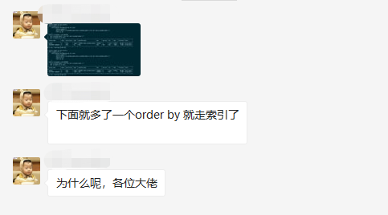
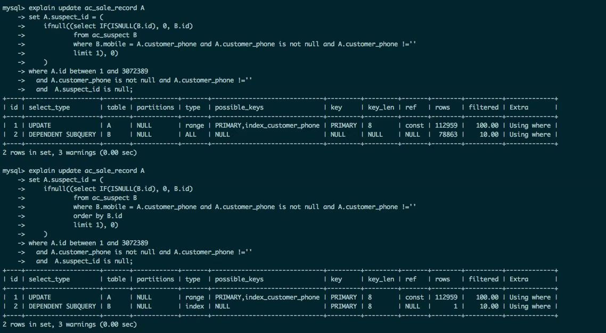
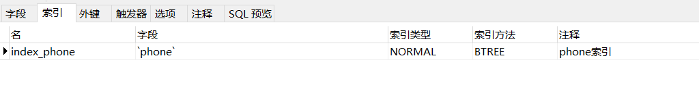

## 一、背景

昨天早上，交流群有一位同学提出了一个问题。看下图：





我不是大佬，而且当时我自己的想法也只是猜测，所以并没有回复那位同学，只是接下来自己做了一个测试验证一下。

他只简单了说了一句话，就是同样的sql，一个没加 order by 就全表扫描，一个加了 order by 就走索引了。

我们可以仔细点看一下他提供的图（主要分析子查询即可，就是关于表 B 的查询，因为只有表 B 的查询前后不一致），我们可以先得出两个前提：

1、首先可以肯定的是，where 条件中的 mobile 字段是没有索引的。因为没有 order by 时，是全表扫描，如果 mobile 字段有索引，查询优化器必定会使用 mobile 字段的索引。

2、其实重点不但在 order by，更重要的是在于 order by 后面跟着的字段是 表B 的主键 id。之所以判断 id 为主键，是因为 explain 执行计划里看到使用了 PRIMARY 索引，即主键索引。


## 二、数据准备和场景重现

#### 创建表 user：

```sql
CREATE TABLE `user` (
  `id` int(10) unsigned NOT NULL AUTO_INCREMENT,
  `name` varchar(255) DEFAULT NULL,
  `age` int(11) DEFAULT NULL,
  `phone` varchar(11) DEFAULT NULL,
  PRIMARY KEY (`id`)
) ENGINE=InnoDB AUTO_INCREMENT=100007 DEFAULT CHARSET=utf8;
```

#### 准备数据：

看了一下截图，数据量应该在10万左右，我们也准备10万数据，尽量做到一致。

```sql
delimiter ;
CREATE DEFINER=`root`@`localhost` PROCEDURE `iniData`()
begin
  declare i int;
  set i=1;
  while(i<=100000)do
    insert into user(name,age,phone) values('测试', i, 15627230000+i);
    set i=i+1;
  end while;
end;;
delimiter ;

call iniData();
```

#### 执行 SQL ，查看执行计划：

```sql
explain select * from user where phone = '15627231000' limit 1;
explain select * from user where phone = '15627231000' order by id limit 1;
```

#### 执行结果：

```sql
id select_type table partitions type possible_keys key key_len ref rows filtered Extra
1	SIMPLE	   user	 (Null)	    ALL	 (Null)	(Null) (Null) (Null) 99927	10	Using where

id select_type table partitions type possible_keys key key_len ref rows filtered Extra
1	SIMPLE	 user	 (Null)	    index   (Null)	   PRIMARY	4	1	10	Using where
```

我们可以看到，执行计划和那位同学的基本一致，都是第一条 SQL 全表扫描，第二条 SQL 是走了主键索引。


## 三、猜想和猜测着总结

#### 只要加 order by 就走索引？

根据上面的执行计划来看，明显这位同学的表达是不对的，更重要的是因为 order by 后跟着的字段是主键 id，所以才走了索引，走了**主键索引**。

我们可以试试用 age 字段来排序，这时候肯定是没有走索引的，因为我们压根没有为  age  字段没有建立索引。

```sql
explain select * from user where phone = '15627231000' order by age limit 1;
```

```sql
id select_type table partitions type possible_keys key key_len ref rows filtered Extra
1	SIMPLE	   user	 (Null)	    ALL	 (Null)	(Null) (Null) (Null) 99927	10	Using where; Using filesort
```

#### 分析：

首先，我们看到 type 是 ALL，就是全表扫描，而且我们还留意到：Extra的值多了 using filesort，表明 MySQL 有文件排序的操作。

我们可以拿 order by age 和 order by id 的执行计划来对比一下。

##### 1、explain 的 tepe 字段：

首先，type 不一样，一个是 index，表明利用了索引树；一个是 ALL，表明是全表扫描。

##### 2、explain 的 Extra 字段：

第二，也是最重点的，它其实可以说明为何利用了主键索引。就是 Extra 字段。

先说明一下正常的排序，Extra 都会有 Using filesort 来表明使用了文件排序。

而明显 order by id 是没有这个，这是因为，索引树本来就是一个**带有顺序**的数据结构，大家不了解的可以去看看 B+Tree 的介绍。**查询优化器正是利用了索引的顺序性，使得 SQL 的执行计划走主键索引树来去掉原本需要的排序。**

之前的大白话 MySQL 学习总结中也提到过`查询优化器`。SQL 的执行计划能有很多，并且结果是一样的，但是为了提高性能，MySQL 的`查询优化器`组件会为 SQL 制定一套最优的执行计划。

#### 阶段总结：

查询优化器帮我们制定的最优计划是：充分利用主键索引的顺序性，避免了全表扫描后还是需要排序操作。

当然了，我们不能自己只是根据现象做判断，下面将利用 Trace 来查看优化器追踪的信息，进一步的验证我们的总结是没问题的。


## 四、通过 Trace 分析来验证

#### 开启和查看 Trace

```sql
-- 开启优化器跟踪
set session optimizer_trace='enabled=on';
select * from user where phone = '15627231000' order by id limit 1;
-- 查看优化器追踪
select * from information_schema.optimizer_trace;
```

下面我们只看 TRACE 就行了。

```json
{
  "steps": [
    {
      "join_preparation": {
        "select#": 1,
        "steps": [
          {
            "expanded_query": "/* select#1 */ select `user`.`id` AS `id`,`user`.`name` AS `name`,`user`.`age` AS `age`,`user`.`phone` AS `phone` from `user` where (`user`.`phone` = '15627231000') order by `user`.`id` limit 1"
          }
        ]
      }
    },
    {
      "join_optimization": { // 优化工作的主要阶段
        "select#": 1,
        "steps": [
          //  .... 省略很多步骤
          {
            "reconsidering_access_paths_for_index_ordering": { // 重新考虑索引排序的访问路径
              "clause": "ORDER BY",
              "index_order_summary": {
                "table": "`user`",
                "index_provides_order": true,
                "order_direction": "asc",
                "index": "PRIMARY", // 排序的字段为主键 id，有主键索引
                "plan_changed": true, // 改变执行计划
                "access_type": "index"
              }
            }
          },
          {
            "refine_plan": [
              {
                "table": "`user`"
              }
            ]
          }
        ]
      }
    },
    {
      "join_explain": {
        "select#": 1,
        "steps": [
        ]
      }
    }
  ]
}
```

好了，在最后的那里，我们看到了查询优化器帮我们使用了主键索引。

所以，我们上面的猜想是正确的，因为 where 条件后的 phone 字段没有加上索引，所以到 order by id 时，查询优化器发现可以利用主键索引所以来避免排序，所以最后就使用了主键索引。

那么，按照上面的说法，如果 phone 字段加上了索引，那么最后应该就是走 phone 的索引而不是主键索引了。而且，SQL 调优有那么一条建议：建议经常在 where 条件后出现的字段加上索引来提高查询性能。

下面我们来继续验证一下我们的猜想。


## 五、关于 where 条件字段索引和 order by 字段索引的选择

#### 1、给字段 phone 增加索引：



#### 2、执行 SQL ：

```sql
explain select * from user where phone = '15627231000' order by id limit 1;
```


#### 3、结果：

我们可以看到，最后查询优化器判断 phone索引 比 主键索引 更能提高性能，所以使用了 phone 的索引。

```sql
id select_type table partitions type possible_keys key key_len ref rows filtered Extra
1	SIMPLE	 user	 (Null)	    index index_phone index_phone	36	1	100	Using index condition
```


#### 4、Trace进一步验证：

最后，我们可以看到，查询优化器否定了使用主键索引，不改变之前的执行计划。

```sql
-- 开启优化器跟踪
set session optimizer_trace='enabled=on';
select * from user where phone = '15627231000' order by id limit 1;
-- 查看优化器追踪
select * from information_schema.optimizer_trace;
```

Trace 分析：

```json
{
  "steps": [
    {
      "join_preparation": {
        "select#": 1,
        "steps": [
          {
            "expanded_query": "/* select#1 */ select `user`.`id` AS `id`,`user`.`name` AS `name`,`user`.`age` AS `age`,`user`.`phone` AS `phone` from `user` where (`user`.`phone` = '15627231000') order by `user`.`id` limit 1"
          }
        ]
      }
    },
    {
      "join_optimization": {
        "select#": 1,
        "steps": [
          //  .... 省略很多步骤
          {
            "considered_execution_plans": [
              {
                "plan_prefix": [
                ],
                "table": "`user`",
                "best_access_path": {
                  "considered_access_paths": [
                    {
                      "access_type": "ref",
                      "index": "index_phone",
                      "rows": 1,
                      "cost": 1.2,
                      "chosen": true
                    },
                    {
                      "access_type": "range",
                      "range_details": {
                        "used_index": "index_phone" // 使用 phone 的索引
                      },
                      "chosen": false,
                      "cause": "heuristic_index_cheaper"
                    }
                  ]
                },
                "condition_filtering_pct": 100,
                "rows_for_plan": 1,
                "cost_for_plan": 1.2,
                "chosen": true
              }
            ]
          },
          {
            "attaching_conditions_to_tables": {
              "original_condition": "(`user`.`phone` = '15627231000')",
              "attached_conditions_computation": [
              ],
              "attached_conditions_summary": [
                {
                  "table": "`user`",
                  "attached": null
                }
              ]
            }
          },
          {
            "clause_processing": {
              "clause": "ORDER BY",
              "original_clause": "`user`.`id`",
              "items": [
                {
                  "item": "`user`.`id`"
                }
              ],
              "resulting_clause_is_simple": true,
              "resulting_clause": "`user`.`id`"
            }
          },
          {
            "added_back_ref_condition": "((`user`.`phone` <=> '15627231000'))"
          },
          {
            "reconsidering_access_paths_for_index_ordering": { // 重新考虑索引排序的访问路径
              "clause": "ORDER BY",
              "index_order_summary": {
                "table": "`user`",
                "index_provides_order": true,
                "order_direction": "asc",
                "index": "index_phone",
                "plan_changed": false  // 不改变执行计划
              }
            }
          },
          {
            "refine_plan": [
              {
                "table": "`user`",
                "pushed_index_condition": "(`user`.`phone` <=> '15627231000')",
                "table_condition_attached": null
              }
            ]
          }
        ]
      }
    },
    {
      "join_explain": {
        "select#": 1,
        "steps": [
        ]
      }
    }
  ]
}
```


## 六、最后总结

到这里，分析就结束了，我们可以得出一个结论，当然了，只是基于上面的实验所得：

1、SQL 带有 order by ：

- order by 后面的字段有索引：
  - where 条件后面的所有字段都没索引，则使用 order by 后面的字段的索引。

  - where 条件后面有字段带有索引，则使用 where 条件对应的字段的索引。

- order by 后面的字段没有索引：
  - where 条件后面的所有字段都没索引，则全表扫描。
  - where 条件后面有字段带有索引，则使用 where 条件后面的字段的索引。

2、SQL 不带 order by：

- where 条件后面的所有字段都没索引，则全表扫描。

- where 条件后面只要有字段带索引，则使用该字段对应的索引。

最后我们也可以得出一个绝对的结论：查询优化器是真的好使，哈哈哈！


## 七、题外话

其实上面的实验需要大家对 MySQL 的索引原理有一定的了解，但是不用特别深。

如果大家感兴趣的话，可以关注一下我现在写的 [【大白话系列】MySQL 学习总结](https://blog.csdn.net/howinfun/category_9704174.html) 这一系列的文章，我会将自己学习 MySQL 后的学习总结分享在这里。