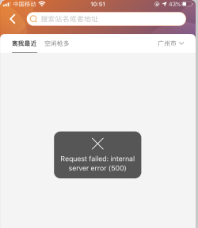
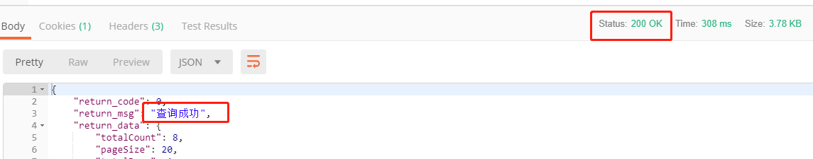
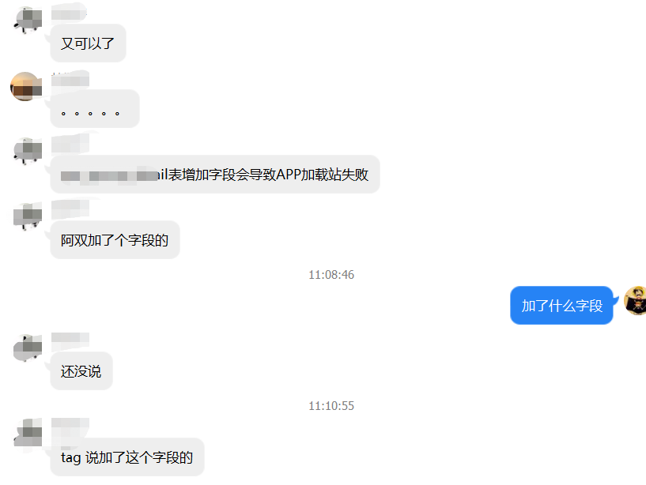
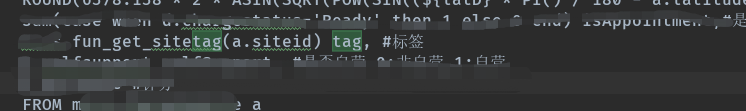
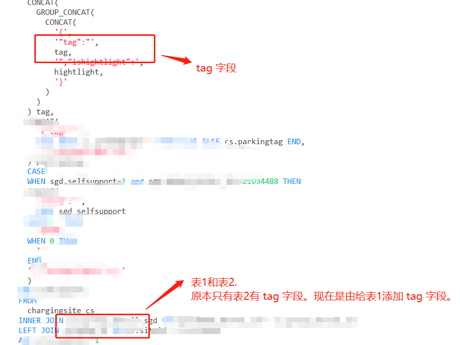
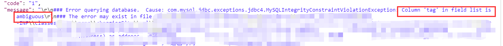

## 一、生产出错！

今天早上11点左右，我在工作休息之余，撸了一下猫。突然，工作群响了，老大在里面说：APP出错了！

妈啊，这太吓人了，因为只是说了出错，但是没说错误的信息。所以我赶紧到APP上看看。

这果然是出错了，而且还是简单而粗暴的500，太吓人了。

## 二、本地赶紧调试起来！

既然线上出错了，我们又不能直接进行调试，那当然得马上在本地搞起来了！

#### 1、代码是否有错？

立马启动本地的项目，访问对应的接口，看看是不是代码哪里出错了。

好了，本地的代码和 SQL 都是没错的！

#### 2、SQL 是否有错？

那么是不是测试库和生产库的表改了啥？

我又立马拿着后台打印的 SQL 直接去到测试库上面执行一遍，看看究竟是不是 SQL 可能存在问题。emm，结果还是没错。

至于生产库，因为是在家办公，测不了~而且，一般修改都是先本地，接着测试，最后再生产吧。但是也有可能是紧急的需求，直接上生产了，这个也不好说。

此时，首先我们可以得出两个点。

1. 代码是没问题的，因为本地的项目访问正常。

2. SQL 暂时也是没问题的，因为在本地库和测试库执行都没问题。

#### 3、猜想

所以说，出现这个 bug，很有可能是有人直接对**生产库**的某个表进行了修改，而且我接口的 SQL 还用到了！

## 三、我啥都没改就又可以了！

#### 1、找到原因了

既然代码和 SQL 都测过没问题了，只剩下**生产库**待确认了。

果不其然，不一会儿，老大又在群里说接口没问题了。老大的回复很明显，就是生产环境的某个表增加了一个字段，而且我的 SQL 确实用到那个表了。

#### 2、深入原因

再回头来看看接口的 SQL，根据 tag 这个关键字搜索一下哪里用到了。发现了只有一个函数是关于 tag 的，所以去数据库里面看看这个函数。

函数源码：

到了这里，相信大家都晓得是什么情况了。

一个表新增 tag 字段后，导致两个表同时存在命名为 tag 的字段。而查询的时候没加上对应的表前缀，导致 MySQL 无法识别结果集到底是用哪个表的 tag 字段，最后就报错了。

## 四、具体的错误信息和总结

#### 1、获取具体的错误信息

原来仅仅是一个小小的 SQL 规范问题，导致了一次生产线上的 bug。

因为异常是经过封装的，所以 APP 只返回了服务器异常（500）。所以我在本地重现了一下这个 bug，就是为了拿到具体的错误信息。

错误信息很简单和明了：Column 'tag' in field list is ambiguous。中文就是字段 tag 模棱两可。

#### 2、总结：

1. 所以说。虽然写 SQL 很简单，但是我们一定要按照规范些，不能说现在不出错就是没问题了，按照规范写更是为了避免以后的出错，以后我也要好好注意才行！
2. 而且，我们既然做了全局异常处理，但是一定要将错误信息打印到后台或者是日志中，不然就像今次找不到具体的错误信息了~

**题外话：**

当然了，写出一手好 SQL ，不但要按照规范写，还需要深刻理解 MySQL 的组件和机制的原理。例如：binlog、undo、innoDB存储引擎、锁、索引和事务等等。

如果大家也想深入学习 MySQL ，可以关注我现在不断在输出的[【大白话系列】MySQL 学习总结](https://blog.csdn.net/howinfun/category_9704174.html)专栏。