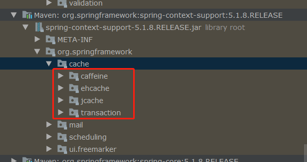
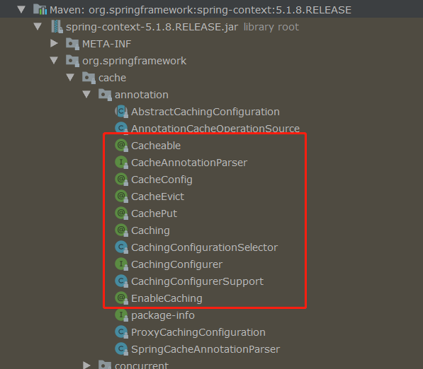
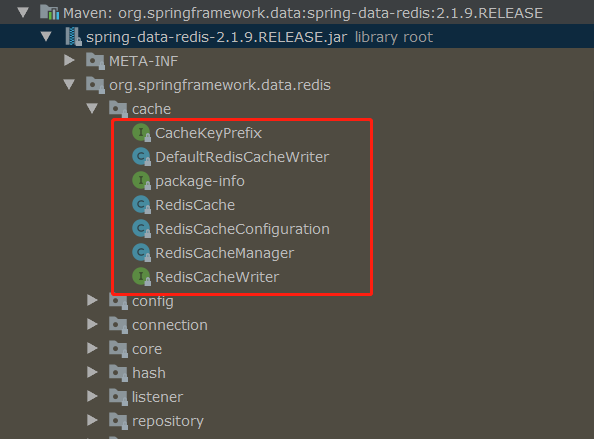
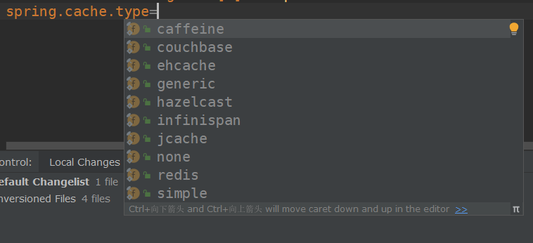

## 一、缓存

当系统的并发量上来了，如果我们频繁地去访问数据库，那么会使数据库的压力不断增大，在高峰时甚至可以出现数据库崩溃的现象。所以一般我们会使用缓存来解决这个数据库并发访问问题，用户访问进来，会先从缓存里查询，如果存在则返回，如果不存在再从数据库里查询，最后添加到缓存里，然后返回给用户，当然了，接下来又能使用缓存来提供查询功能。

而缓存，一般我们可以分为本地缓存和分布式缓存。

常用的本地缓存有 ehcache、guava cache，而我们一般都是使用 ehcache，毕竟他是纯 Java 的，出现问题我们还可以根据源码解决，并且还能自己进行二次开发来扩展功能。

常用的分布式缓存当然就是 Redis 了，Redis 是基于内存和单线程的，执行效率非常的高。


## 二、Spring Cache

相信如果要整合缓存到项目中，大家都会使用到 Spring Cache，它不但整合了多种缓存框架（ehcache、jcache等等），还可以基于注解来使用，是相当的方便。

缓存框架的整合在 spring-context-support 中：



缓存注解在 spring-context 中：



当然了，在 Spring 的 context 中没有整合 Redis，但是我们可以在 spring-data-redis 中找到。



但是我们都知道，不管是在 Spring 项目 还是 Spring Boot 中，我们都只能整合一种缓存，不能同时整合多种缓存。

在 Spring Boot 中，我们一般是利用 `spring.cache.type` 来指定使用哪种缓存，然后填写相关配置信息来完成自动配置。



CacheType 的源码：我们可以看到，Spring 是支持非常多种缓存框架的。

```java
package org.springframework.boot.autoconfigure.cache;

public enum CacheType {
    GENERIC,
    JCACHE,
    EHCACHE,
    HAZELCAST,
    INFINISPAN,
    COUCHBASE,
    REDIS,
    CAFFEINE,
    SIMPLE,
    NONE;

    private CacheType() {
    }
}
```

那么如果我们就是有这么一种需求，要整合两种缓存框架：例如一个本地缓存 Ehcache，一个分布式缓存 Redis，

那能整么？

能是能，但是 Spring 可不提供这种多级缓存，而是需要你自己动手来整了。


## 三、h2cache-spring-boot-starter

### 1、什么是 h2cache-spring-boot-starter?

在微服务中，每个服务都是无状态的，服务之间需要经过 HTTP 或者 RPC 来进行通信。而每个服务都拥有自己对应的数据库，所以说如果服务A 需要获取服务B 的某个表的数据，那么就需要一次 HTTP 或 RPC 通信，那如果高峰期每秒需要调用100次，那岂不是需要100次 HTTP 或 RPC 通信，这是相当耗费接口性能的。

那怎么解决呢？

本地缓存那是肯定不是的，因为一般不同服务都是部署在不同的机器上面的，所以此时我们需要的是分布式缓存，例如 Redis；但是，访问量高的的服务当然还是需要本地缓存了。所以最后，我们不但需要本地缓存，还需要分布式缓存，但是 Spring Boot 却不能提供这种多级缓存的功能，所以需要我们自己来整合。

不用怕，我已经自己整了一个 Spring Boot Starter了，就是` h2cache-spring-boot-starter`，我们只需要在配置文件配置上对应的信息，就可以启用这个多级缓存的功能了。

### 2、开始使用

#### 添加依赖：

```xml
<denpency>
    <groupId>com.github.howinfun</groupId>
    <artifactId>h2cache-spring-boot-starter</artifactId>
    <version>0.0.1</version>
</denpency>
```

#### 在 Spring Boot properties 启用服务，并且加上对应的配置：

开启多级缓存服务：

```properties
# Enable L2 cache or not
h2cache.enabled=true
```

配置 Ehcache：

```properties
# Ehcache Config
## the path of ehcache.xml (We can put it directly under Resources) 
h2cache.ehcache.filePath=ehcache.xml
#Set whether the EhCache CacheManager should be shared (as a singleton at the ClassLoader level) or independent (typically local within the application).Default is "false", creating an independent local instance.
h2cache.ehcache.shared=true
```

配置 Redis：主要包括默认的缓存配置和自定义缓存配置

要注意一点的是：h2cache-spring-boot-starter 同时引入了 `Lettuce` 和 `Jedis` 客户端，而 Spring Boot 默认使用 Lettuce 客户端，所以如果我们需要使用 Jedis 客户端，需要将 Lettuce 依赖去除掉。

```properties
# Redis Config
## default Config (expire)
h2cache.redis.default-config.ttl=200
### Disable caching {@literal null} values.Default is "false"
h2cache.redis.default-config.disable-null-values=true
### Disable using cache key prefixes.Default is "true"
h2cache.redis.default-config.use-prefix=true

## Custom Config list
### cacheName -> @CacheConfig#cacheNames @Cacheable#cacheNames and other comments, etc   
h2cache.redis.config-list[0].cache-name=userCache
h2cache.redis.config-list[0].ttl=60
h2cache.redis.config-list[0].use-prefix=true
h2cache.redis.config-list[0].disable-null-values=true

h2cache.redis.config-list[1].cache-name=bookCache
h2cache.redis.config-list[1].ttl=60
h2cache.redis.config-list[1].use-prefix=true

#Redis
spring.redis.host=10.111.0.111
spring.redis.password=
spring.redis.port=6379
spring.redis.database=15
# 连接池最大连接数（使用负值表示没有限制）
spring.redis.jedis.pool.max-active=8
# 连接池中的最小空闲连接
spring.redis.jedis.pool.min-idle=0
# 连接池中的最大空闲连接
spring.redis.jedis.pool.max-idle=8
# 连接池最大阻塞等待时间（使用负值表示没有限制）
spring.redis.jedis.pool.max-wait=30
```

#### 如何使用缓存注解

我们只要像之前一样使用 `Spring Cache` 的注解即可。

**for example：**

代码里的持久层，我使用的是： [mybatis-plus](https://github.com/baomidou/mybatis-plus#links).

```
package com.hyf.testDemo.redis;

import com.baomidou.mybatisplus.core.mapper.BaseMapper;
import org.springframework.cache.annotation.CacheConfig;
import org.springframework.cache.annotation.CacheEvict;
import org.springframework.cache.annotation.CachePut;
import org.springframework.cache.annotation.Cacheable;
import org.springframework.cache.annotation.Caching;
import org.springframework.stereotype.Repository;

/**
 * @author Howinfun
 * @desc
 * @date 2020/3/25
 */
@Repository
// Global cache config,We usually set the cacheName               
@CacheConfig(cacheNames = {"userCache"})
public interface UserMapper extends BaseMapper<User> {

    /**
    * put the data to cache(Ehcache & Redis)
    * @param id
    * @return 
    */
    @Cacheable(key = "#id",unless = "#result == null")
    User selectById(Long id);

    /**
    * put the data to cache After method execution
    * @param user
    * @return 
    */
    @CachePut(key = "#user.id", condition = "#user.name != null and #user.name != ''")
    default User insert0(User user) {
        
        this.insert(user);
        return user;
    }

    /**
    * evict the data from cache
    * @param id
    * @return 
    */
    @CacheEvict(key = "#id")
    int deleteById(Long id);

    /**
    * Using cache annotations in combination
    * @param user
    * @return 
    */
    @Caching(
            evict = {@CacheEvict(key = "#user.id", beforeInvocation = true)},
            put = {@CachePut(key = "#user.id")}
    )
    default User updateUser0(User user){
        
        this.updateById(user);
        return user;
    }
}
```

### 测试一下：

查询：我们可以看到，在数据库查询到结果后，会将数据添加到 `Ehcache` 和 `Redis` 缓存中；接着之后的查询都将会先从 `Ehcache` 或者 `Redis` 里查询。

```
2020-04-03 09:55:09.691  INFO 5920 --- [nio-8080-exec-7] com.zaxxer.hikari.HikariDataSource       : HikariPool-1 - Starting...
2020-04-03 09:55:10.044  INFO 5920 --- [nio-8080-exec-7] com.zaxxer.hikari.HikariDataSource       : HikariPool-1 - Start completed.
2020-04-03 09:55:10.051 DEBUG 5920 --- [nio-8080-exec-7] c.h.t.redis.BookMapper2.selectById       : ==>  Preparing: SELECT id,create_time,update_time,read_frequency,version,book_name FROM book WHERE id=? 
2020-04-03 09:55:10.068 DEBUG 5920 --- [nio-8080-exec-7] c.h.t.redis.BookMapper2.selectById       : ==> Parameters: 51(Long)
2020-04-03 09:55:10.107 DEBUG 5920 --- [nio-8080-exec-7] c.h.t.redis.BookMapper2.selectById       : <==      Total: 1
2020-04-03 09:55:10.113  INFO 5920 --- [nio-8080-exec-7] c.hyf.cache.cachetemplate.H2CacheCache   : insert into ehcache,key:51,value:Book2(id=51, bookName=微服务架构, readFrequency=1, createTime=2020-03-20T16:10:13, updateTime=2020-03-27T09:14:44, version=1)
2020-04-03 09:55:10.118  INFO 5920 --- [nio-8080-exec-7] c.hyf.cache.cachetemplate.H2CacheCache   : insert into redis,key:51,value:Book2(id=51, bookName=微服务架构, readFrequency=1, createTime=2020-03-20T16:10:13, updateTime=2020-03-27T09:14:44, version=1)

2020-04-03 09:55:31.864  INFO 5920 --- [nio-8080-exec-2] c.hyf.cache.cachetemplate.H2CacheCache   : select from ehcache,key:51
```

删除：删除数据库中的数据后，也会删除 `Ehcache` 和 `Redis` 中对应的缓存数据。

```
2020-04-03 10:05:18.704 DEBUG 5920 --- [nio-8080-exec-3] c.h.t.redis.BookMapper2.deleteById       : ==>  Preparing: DELETE FROM book WHERE id=? 
2020-04-03 10:05:18.704 DEBUG 5920 --- [nio-8080-exec-3] c.h.t.redis.BookMapper2.deleteById       : ==> Parameters: 51(Long)
2020-04-03 10:05:18.731 DEBUG 5920 --- [nio-8080-exec-3] c.h.t.redis.BookMapper2.deleteById       : <==    Updates: 1
2020-04-03 10:05:18.732  INFO 5920 --- [nio-8080-exec-3] c.hyf.cache.cachetemplate.H2CacheCache   : delete from ehcache,key:51
2020-04-03 10:05:18.844  INFO 5920 --- [nio-8080-exec-3] c.hyf.cache.cachetemplate.H2CacheCache   : delete from redis,key:51
```

其他的就不用演示了...


## 四、最后

这个 starter 还是相对比较简单的，如果大家感兴趣，可以去看看源码~