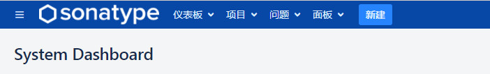
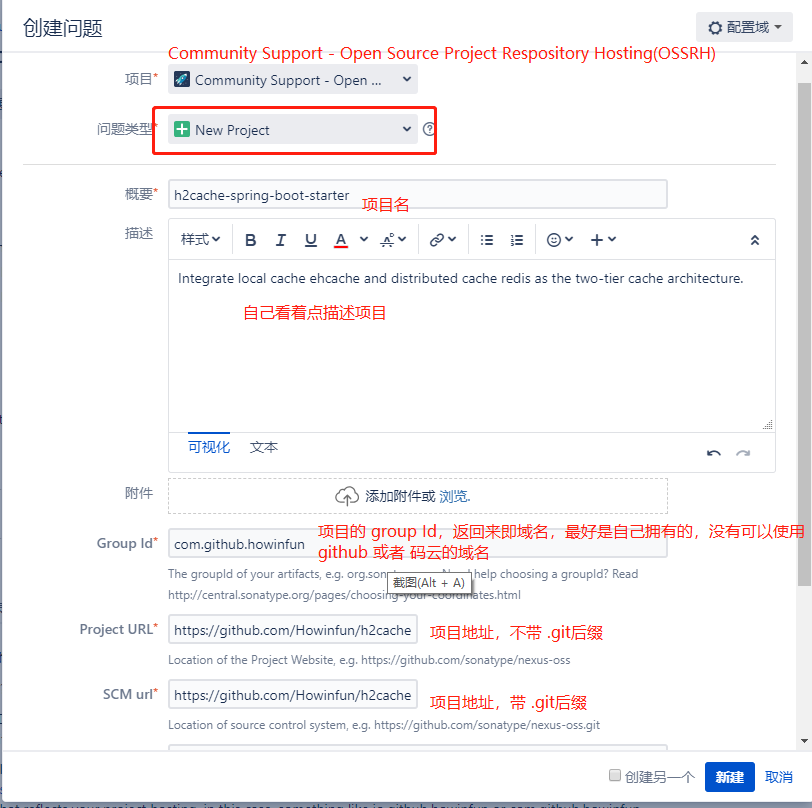
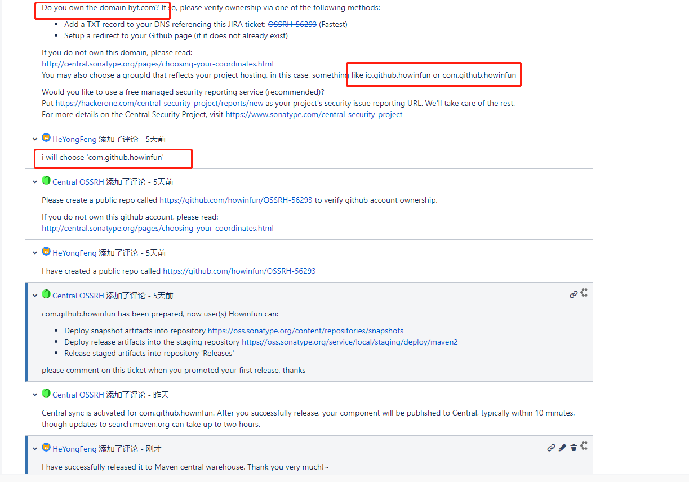
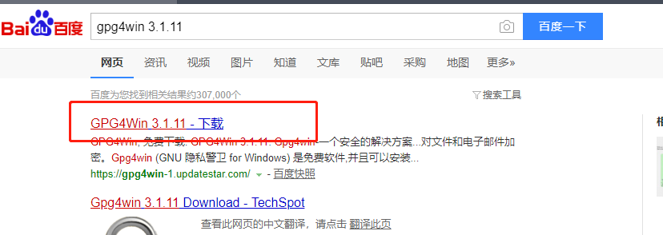
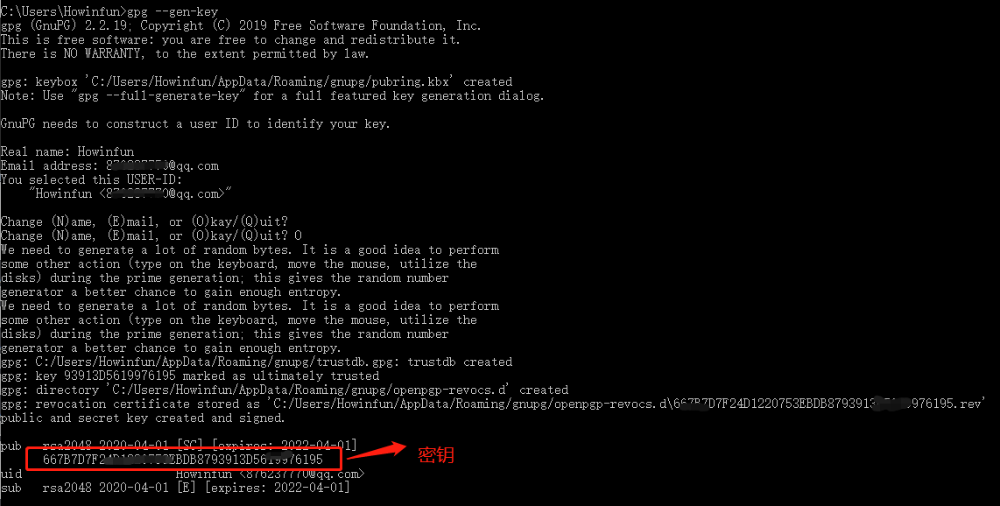
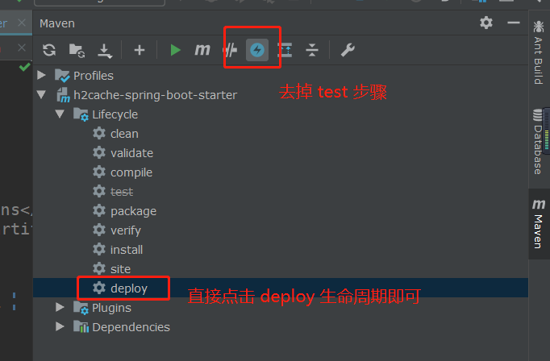
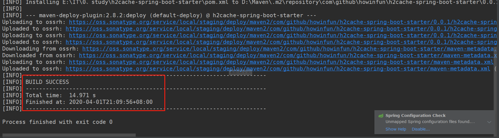
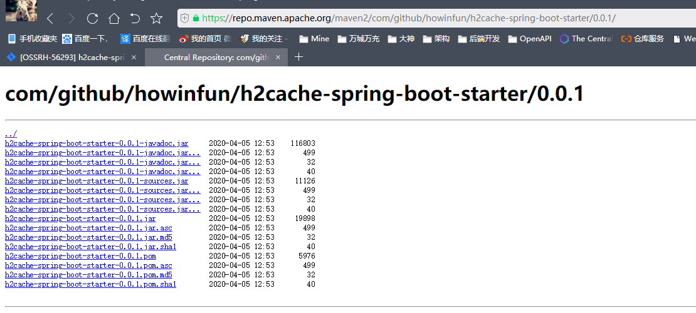

## 前言：开源项目

我相信，拥有自己的开源项目是每个程序员心中最想达成的事，不管是小项目还是大项目。当然了，大项目不是每个程序员都要能力完成的；但是小项目，例如自己编写的 Spring Boot Starter，或者自己编写的工具类，这些还是挺有意思，挺有意义的。

那么当我们编写完项目了，接下来当然是要将自己的开源项目部署到 Maven 的中央仓库里头了，让大家都可以看得见，使用到。下面我会比较详细地介绍如何将自己的开源项目部署到 Maven 去，希望能帮助到大家~

## 1、注册 sonatype

在 [sonatype 官网](https://issues.sonatype.org) 上面注册一个帐号，密码的要求稍微复杂了一点，所以大家创建好最好弄个小本本记录一下。

## 2、登陆 sonatype

新建issue：点击头部导航`新建`按钮



填写表单：可参考下图



新建之后等待审批就行，一般很快，会有邮件通知，到这里可以先进行后面的步骤，如果审批成功可以不用理会，如果中间出现问题，例如像上面提到到的 group Id 对应的域名你是否为拥有者，此时你需要在issue上回复就行。



## 3、下载安装 gunpg

直接在百度搜然后下载即可。



安装完，我们打开 cmd 窗口，输入 `gpg --version` 检查是否安装成功，默认是添加环境变量是没问题的，如果找不到，手动将安装目录下的`bin`目录追加到环境变量`path`路径下。

## 4、创建密钥

执行 `gpg --gen-key`，根据提示输入即可，要输入 Name & Email 等等。

最后会提示输入 `passphrase`，设置之后我们一定要记录下来，后面部署项目到 Maven 中央仓库会需要用到。

然后输入确认后会显示密钥信息，当然了，也可以输入 `gen --list-key` 命令看看有哪些密钥。



## 5、上传密钥

```
gpg --keyserver http://pool.sks-keyservers.net:11371 --send-keys 8D2522AA90CD41AC1735DCBE52608BB84871117D

gpg --keyserver http://keyserver.ubuntu.com:11371 --send-keys 8D2522AA90CD41AC1735DCBE52608BB84871117D

gpg --keyserver http://keys.gnupg.net:11371 --send-keys 8D2522AA90CD41AC1735DCBE52608BB84871117D

```

**命令格式为：**

```
gpg --keyserver 服务器地址 --send-keys 密钥
```

一般上传上面三个就可以了，但是如果不够，部署时是会提示的，按照提示继续上传即可。

## 6、修改 Maven 的 setting.xml配置

增加下面的配置即可。

```xml
<?xml version="1.0" encoding="UTF-8"?>

<settings xmlns="http://maven.apache.org/SETTINGS/1.0.0"
          xmlns:xsi="http://www.w3.org/2001/XMLSchema-instance"
          xsi:schemaLocation="http://maven.apache.org/SETTINGS/1.0.0 http://maven.apache.org/xsd/settings-1.0.0.xsd">
  <!-- 省略其他配置 -->
  <servers>
    <server>
      <id>ossrh</id>
      <username>sonatype账号</username>
      <password>sonatype密码</password>
    </server>
  </servers>
  <profiles>
    <profile>
      <id>ossrh</id>
      <activation>
        <activeByDefault>true</activeByDefault>
      </activation>
      <properties>
        <gpg.passphrase>生成密钥时输入的passphrase</gpg.passphrase>
        <!-- gpg.exe的绝对路径，在gpg安装目录下的bin目录中 -->
        <gpg.executable>D:\Program Files (x86)\GnuPG\bin\gpg.exe</gpg.executable>
        <!-- 上一步执行gpg --list-key命令输出的路径，一般在C:\User\当前用户\AppData\Roaming\gnupg -->
        <gpg.homedir>C:\Users\Administrator\AppData\Roaming\gnupg</gpg.homedir>
      </properties>
    </profile>
  </profiles>
</settings>
```


## 7、修改 pom.xml

参考：https://bitbucket.org/simpligility/ossrh-pipeline-demo
首先当然修改项目的版本号了，不用再带 SNAPSHOT 了

```xml
<groupId>com.github.howinfun</groupId>
<artifactId>h2cache-spring-boot-starter</artifactId>
<version>0.0.1</version>   
```

增加开源协议：根据你自己项目的开源协议配置即可

```xml
<licenses>
    <license>
        <name>MIT License</name>
        <url>http://www.opensource.org/licenses/mit-license.php</url>
    </license>
</licenses>
```

增加开发者的信息：

```xml
 <developers>
     <developer>
         <name>Howinfun</name>
         <!-- 邮件 -->
         <email>876237770@qq.com</email>
         <!-- 开源地址 -->
         <url>https://github.com/Howinfun</url>
     </developer>
</developers>
```

增加项目地址：

```xml
<scm>
    <url>https://github.com/Howinfun/h2cache-spring-boot-starter</url>
    <connection>https://github.com/Howinfun/h2cache-spring-boot-starter.git</connection>
    <developerConnection>https://github.com/Howinfun</developerConnection>
</scm>
```

增加 sonatype 配置：

```xml
<distributionManagement>
    <snapshotRepository>
        <id>ossrh</id>
        <url>https://oss.sonatype.org/content/repositories/snapshots</url>
    </snapshotRepository>
    <repository>
        <id>ossrh</id>
        <url>https://oss.sonatype.org/service/local/staging/deploy/maven2</url>
    </repository>
</distributionManagement>
```

增加插件：

```xml
<build>
    <plugins>
        <plugin>
            <groupId>org.apache.maven.plugins</groupId>
            <artifactId>maven-compiler-plugin</artifactId>
            <version>3.8.1</version>
            <configuration>
                <target>1.8</target>
                <source>1.8</source>
            </configuration>
        </plugin>
        <plugin>
            <groupId>org.apache.maven.plugins</groupId>
            <artifactId>maven-source-plugin</artifactId>
            <version>3.0.1</version>
            <executions>
                <execution>
                    <id>attach-sources</id>
                    <goals>
                        <goal>jar-no-fork</goal>
                    </goals>
                </execution>
            </executions>
        </plugin>
        <plugin>
            <groupId>org.apache.maven.plugins</groupId>
            <artifactId>maven-javadoc-plugin</artifactId>
            <version>2.9.1</version>
            <executions>
                <execution>
                    <id>attach-javadocs</id>
                    <goals>
                        <goal>jar</goal>
                    </goals>
                </execution>
            </executions>
        </plugin>
        <plugin>
            <groupId>org.apache.maven.plugins</groupId>
            <artifactId>maven-gpg-plugin</artifactId>
            <version>1.1</version>
            <executions>
                <execution>
                    <id>sign-artifacts</id>
                    <phase>verify</phase>
                    <goals>
                        <goal>sign</goal>
                    </goals>
                </execution>
            </executions>
        </plugin>
    </plugins>
</build>
```

增加一个配置，解决 JDK1.8 环境下发布出现的问题：

```xml
<profiles>
    <profile>
        <id>disable-javadoc-doclint</id>
        <activation>
            <jdk>[1.8,)</jdk>
        </activation>
        <properties>
            <additionalparam>-Xdoclint:none</additionalparam>
        </properties>
    </profile>
</profiles>
```


## 8、部署

利用 IDEA 的 Maven 模块去部署就可以了。



最后会提示构建成功~




## 9、手动发布

按照以上步骤，项目发布到 sonatype 后会自动close，然后release，但是由于网络延迟等原因，有可能会失败，所以我们自己手动发布就更好咯。

1. 打开https://oss.sonatype.org并登录，切换到stagingRepositories菜单。

2. 找到自己的项目，选中之后点击close按钮，关闭需要时间，可以等一会再回来看

3. 等待项目关闭完成之后，选中项目点击release按钮，发布需要时间，点击发布之后就不需要操作了，发布完成后会自动删除项目。
4. 最后，一两个小时后我们可以在 maven 仓库里面找到自己的项目了。

