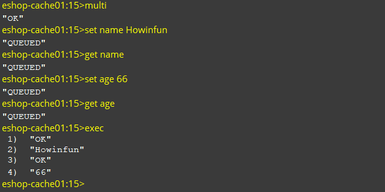

### 一、事务的实现原理

一个事务从开始到结束通常会经历以下三个阶段：

#### 1、事务开始

客户端发送 **MULTI** 命令，服务器执行 MULTI 命令逻辑。

服务器会在客户端状态（redisClient）的 **`flags`** 属性打开 **REDIS_MULTI** 标识，将客户端从非事务状态切换到事务状态。

```c
void multiCommand(redisClient *c) {

    // 不能在事务中嵌套事务
    if (c->flags & REDIS_MULTI) {
        addReplyError(c,"MULTI calls can not be nested");
        return;
    }

    // 打开事务 FLAG
    c->flags |= REDIS_MULTI;

    addReply(c,shared.ok);
}
```

#### 2、命令入队

接着，用户可以在客户端输入当前事务要执行的多个命令。

当客户端切换到事务状态时，服务器会根据客户端发来的命令来执行不同的操作。

- 如果客户端发送的命令为 EXEC、DISCARD、WATCH、MULTI 四个命令的其中一个，那么服务器立即执行这个命令。

- 与此相反，如果客户端发送的命令是 EXEC、DISCARD、WATCH、MULTI 四个命令以外的其他命令，那么服务器并不立即执行这个命令。
  - 首先检查此命令的格式是否正确，如果不正确，服务器会在客户端状态（redisClient）的 **`flags`** 属性打开 **REDIS_MULTI** 标识，并且返回错误信息给客户端。
  - 如果正确将这个命令放入一个**事务队列**里面，然后向客户端返回 QUEUED 回复。

##### 我们先看看事务队列是如何实现的？

每个 Redis 客户端都有自己的事务状态，对应的是客户端状态（redisClient）的 **`mstate`** 属性。

```c
typeof struct redisClient{
    // 事务状态
    multiState mstate;
}redisClient;
```

事务状态（mstate）包含一个事务队列（FIFO 队列），以及一个已入队命令的计数器。

```c
/*
 * 事务状态
 */
typedef struct multiState {

    // 事务队列，FIFO 顺序
    multiCmd *commands;     /* Array of MULTI commands */
    // 已入队命令计数
    int count;              /* Total number of MULTI commands */
    int minreplicas;        /* MINREPLICAS for synchronous replication */
    time_t minreplicas_timeout; /* MINREPLICAS timeout as unixtime. */
} multiState;
```

事务队列是一个 **`multiCmd`** 类型数组，数组中每个 **`multiCmd`** 结构都保存了一个如入队命令的相关信息：指向命令实现函数的指针，命令的参数，以及参数的数量。

```c
/*
 * 事务命令
 */
typedef struct multiCmd {

    // 参数
    robj **argv;
    // 参数数量
    int argc;
    // 命令指针
    struct redisCommand *cmd;
} multiCmd;
```

##### 最后我们再看看入队列的源码：

```c
/* Add a new command into the MULTI commands queue 
 *
 * 将一个新命令添加到事务队列中
 */
void queueMultiCommand(redisClient *c) {
    multiCmd *mc;
    int j;

    // 为新数组元素分配空间
    c->mstate.commands = zrealloc(c->mstate.commands,
            sizeof(multiCmd)*(c->mstate.count+1));

    // 指向新元素
    mc = c->mstate.commands+c->mstate.count;

    // 设置事务的命令、命令参数数量，以及命令的参数
    mc->cmd = c->cmd;
    mc->argc = c->argc;
    mc->argv = zmalloc(sizeof(robj*)*c->argc);
    memcpy(mc->argv,c->argv,sizeof(robj*)*c->argc);
    for (j = 0; j < c->argc; j++)
        incrRefCount(mc->argv[j]);

    // 事务命令数量计数器增一
    c->mstate.count++;
}
```

当然了，还有我们上面提到的，如果命令入队出错时，会打开客户端状态的 **`REDIS_DIRTY_EXEC`** 标识。

```c
/* Flag the transacation as DIRTY_EXEC so that EXEC will fail.
 *
 * 将事务状态设为 DIRTY_EXEC ，让之后的 EXEC 命令失败。
 *
 * Should be called every time there is an error while queueing a command. 
 *
 * 每次在入队命令出错时调用
 */
void flagTransaction(redisClient *c) {
    if (c->flags & REDIS_MULTI)
        c->flags |= REDIS_DIRTY_EXEC;
}
```

#### 3、事务执行

客户端发送 **EXEC** 命令，服务器执行 EXEC 命令逻辑。

- 如果客户端状态的 flags 属性不包含 `REDIS_MULTI` 标识，或者包含 `REDIS_DIRTY_CAS` 或者 `REDIS_DIRTY_EXEC` 标识，那么就直接取消事务的执行。
- 否则客户端处于事务状态（flags 有 `REDIS_MULTI` 标识），服务器会遍历客户端的事务队列，然后执行事务队列中的所有命令，最后将返回结果全部返回给客户端；

```c
void execCommand(redisClient *c) {
    int j;
    robj **orig_argv;
    int orig_argc;
    struct redisCommand *orig_cmd;
    int must_propagate = 0; /* Need to propagate MULTI/EXEC to AOF / slaves? */

    // 客户端没有执行事务
    if (!(c->flags & REDIS_MULTI)) {
        addReplyError(c,"EXEC without MULTI");
        return;
    }

    /* Check if we need to abort the EXEC because:
     *
     * 检查是否需要阻止事务执行，因为：
     *
     * 1) Some WATCHed key was touched.
     *    有被监视的键已经被修改了
     *
     * 2) There was a previous error while queueing commands.
     *    命令在入队时发生错误
     *    （注意这个行为是 2.6.4 以后才修改的，之前是静默处理入队出错命令）
     *
     * A failed EXEC in the first case returns a multi bulk nil object
     * (technically it is not an error but a special behavior), while
     * in the second an EXECABORT error is returned. 
     *
     * 第一种情况返回多个批量回复的空对象
     * 而第二种情况则返回一个 EXECABORT 错误
     */
    if (c->flags & (REDIS_DIRTY_CAS|REDIS_DIRTY_EXEC)) {

        addReply(c, c->flags & REDIS_DIRTY_EXEC ? shared.execaborterr :
                                                  shared.nullmultibulk);

        // 取消事务
        discardTransaction(c);

        goto handle_monitor;
    }

    /* Exec all the queued commands */
    // 已经可以保证安全性了，取消客户端对所有键的监视
    unwatchAllKeys(c); /* Unwatch ASAP otherwise we'll waste CPU cycles */

    // 因为事务中的命令在执行时可能会修改命令和命令的参数
    // 所以为了正确地传播命令，需要现备份这些命令和参数
    orig_argv = c->argv;
    orig_argc = c->argc;
    orig_cmd = c->cmd;

    addReplyMultiBulkLen(c,c->mstate.count);

    // 执行事务中的命令
    for (j = 0; j < c->mstate.count; j++) {

        // 因为 Redis 的命令必须在客户端的上下文中执行
        // 所以要将事务队列中的命令、命令参数等设置给客户端
        c->argc = c->mstate.commands[j].argc;
        c->argv = c->mstate.commands[j].argv;
        c->cmd = c->mstate.commands[j].cmd;

        /* Propagate a MULTI request once we encounter the first write op.
         *
         * 当遇上第一个写命令时，传播 MULTI 命令。
         *
         * This way we'll deliver the MULTI/..../EXEC block as a whole and
         * both the AOF and the replication link will have the same consistency
         * and atomicity guarantees. 
         *
         * 这可以确保服务器和 AOF 文件以及附属节点的数据一致性。
         */
        if (!must_propagate && !(c->cmd->flags & REDIS_CMD_READONLY)) {

            // 传播 MULTI 命令
            execCommandPropagateMulti(c);

            // 计数器，只发送一次
            must_propagate = 1;
        }

        // 执行命令
        call(c,REDIS_CALL_FULL);

        /* Commands may alter argc/argv, restore mstate. */
        // 因为执行后命令、命令参数可能会被改变
        // 比如 SPOP 会被改写为 SREM
        // 所以这里需要更新事务队列中的命令和参数
        // 确保附属节点和 AOF 的数据一致性
        c->mstate.commands[j].argc = c->argc;
        c->mstate.commands[j].argv = c->argv;
        c->mstate.commands[j].cmd = c->cmd;
    }

    // 还原命令、命令参数
    c->argv = orig_argv;
    c->argc = orig_argc;
    c->cmd = orig_cmd;

    // 清理事务状态
    discardTransaction(c);

    /* Make sure the EXEC command will be propagated as well if MULTI
     * was already propagated. */
    // 将服务器设为脏，确保 EXEC 命令也会被传播
    if (must_propagate) server.dirty++;

handle_monitor:
    /* Send EXEC to clients waiting data from MONITOR. We do it here
     * since the natural order of commands execution is actually:
     * MUTLI, EXEC, ... commands inside transaction ...
     * Instead EXEC is flagged as REDIS_CMD_SKIP_MONITOR in the command
     * table, and we do it here with correct ordering. */
    if (listLength(server.monitors) && !server.loading)
        replicationFeedMonitors(c,server.monitors,c->db->id,c->argv,c->argc);
}
```


### 二、为什么很多人说 Redis 事务为何不支持原子性?

#### 1、Redis 事务不支持事务回滚机制

Redis 事务执行过程中，如果一个命令执行出错，那么就返回错误，然后还是会接着继续执行下面的命令。

下面我们演示一下：


正是因为 Redis 事务不支持事务回滚机制，如果事务执行中出现了命令执行错误（例如对 String 类型的数据库键执行 LPUSH 操作），只会返回当前命令执行的错误给客户端，并不会影响下面的命令的执行。所以很多人觉得和关系型数据库（MySQL） 不一样，而 MySQL 的事务是具有原子性的，所以大家都认为 Redis 事务不支持原子性。

#### 2、但是其实 Redis 意义上是支持原子性的。 

正常情况下，它也是要不所有命令执行成功，要不一个命令都不执行。

##### 我们下面演示一下：

全部执行成功的：



一个都不执行：


这就是上面提到的，在事务开始后，用户可以输入事务要执行的命令；在命令入事务队列前，会对命令进行检查，如果命令不存在或者是命令参数不对，则会返回错误可客户端，并且修改客户端状态。

当后面客户端执行 EXEC 命令时，服务器就会直接拒绝执行此事务了。

所以说，Redis 事务其实是支持原子性的！即使 Redis 不支持事务回滚机制，但是它会检查每一个事务中的命令是否错误。

但是我们要注意一个点就是：Redis 事务不支持检查那些程序员自己逻辑错误。例如对 String 类型的数据库键执行对 HashMap 类型的操作！


#### 我很赞同 Redis 作者的想法：

首先，MySQL 和 Redis 的定位不一样，一个是关系型数据库，一个是 NoSQL。

MySQL 的 SQL 查询是可以相当复杂的，而且 MySQL 没有事务队列这种说法，SQL 真正开始执行才会进行分析和检查，MySQL 不可能提前知道下一条 SQL 是否正确。所以支持事务回滚是非常有必要的~

但是，Redis 使用了事务队列来预先将执行命令存储起来，并且会对其进行格式检查的，提前就知道命令是否可执行了。所以如果只要有一个命令是错误的，那么这个事务是不能执行的。

并且， Redis 作者认为基本只会出现在开发环境的编程错误其实在生产环境基本是不可能出现的（例如对 String 类型的数据库键执行 LPUSH 操作），所以他觉得没必要为了这事务回滚机制而改变 Redis 追求简单高效的设计主旨。

**所以最后，其实 Redis 事务真正支持原子性的前提：开发者不要傻不拉几的写有逻辑问题的代码！**