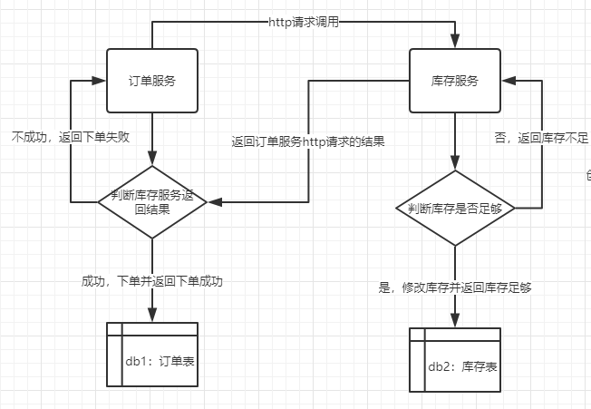
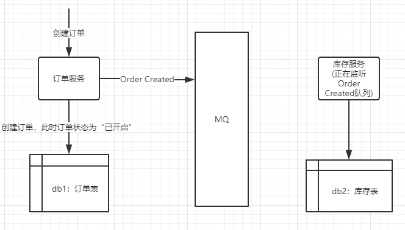
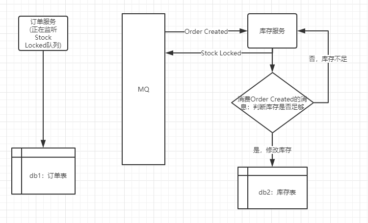
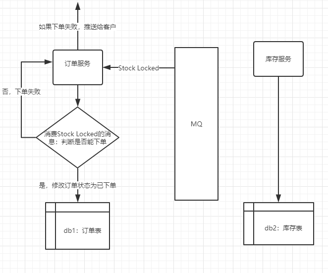

### 事务一致性
首先，我们来回顾一下ACID原则：
- Atomicity：原子性，改变数据状态要么是一起完成，要么一起失败
- Consistency：一致性，数据的状态是完整一致的
- Isolation：隔离线，即使有并发事务，互相之间也不影响
- Durability：持久性， 一旦事务提交，不可撤销

在单体应用中，我们可以利用关系型数据库的特性去完成事务一致性，但是一旦应用往微服务发展，根据业务拆分成不用的模块，而且每个模块的数据库已经分离开了，这时候，我们要面对的就是分布式事务了，需要自己在代码里头完成ACID了。比较流行的解决方案有：两阶段提交、补偿机制、本地消息表（利用本地事务和MQ）、MQ的事务消息（RocketMQ）。
大家可以到此篇文章去了解一下：[分布式事务的四种解决方案](https://hhbbz.github.io/2018/09/06/%E5%88%86%E5%B8%83%E5%BC%8F%E4%BA%8B%E5%8A%A1%E7%9A%84%E5%9B%9B%E7%A7%8D%E8%A7%A3%E5%86%B3%E6%96%B9%E6%A1%88/)

### CAP定理
1998年，加州大学的计算机科学家 Eric Brewer 提出，分布式系统有三个指标。
- Consistency：一致性
- Availability：可用性
- Partition tolerance：分区容错

Eric Brewer 说，这三个指标不可能同时做到。这个结论就叫做 CAP 定理。
微服务中，不同模块之间使用的数据库是不同的，不同模块之间部署的服务去也有可能是不用的，那么分区容错是无法避免的，因为服务之间的调用不能保证百分百的没问题，所以系统设计必须考虑这种情况。因此，我们可以认为CAP的P总是成立的，剩下的C和A无法同时做到。
实际上根据分布式系统中CAP原则，当P(分区容忍)发生的时候，强行追求C（一致性），会导致（A）可用性、吞吐量下降，此时我们一般用最终一致性来保证我们系统的AP能力。当然不是放弃C，而是放弃强一致性，而且在一般情况下CAP都能保证，只是在发生分区容错的情况下，我们可以通过最终一致性来保证数据一致。

### 事件驱动实现最终一致性
事件驱动架构在领域对象之间通过异步的消息来同步状态，有些消息也可以同时发布给多个服务，在消息引起了一个服务的同步后可能会引起另外消息，事件会扩散开。严格意义上的事件驱动是没有同步调用的。
##### 例子：
在电商里面，用户下单必须根据库存来确定订单是否成交。
项目架构：SpringBoot2+Mybatis+tk-Mybatis+ActiveMQ【因为小例子，不做成Spring Cloud架构】
###### 首先，我们来看看正常的服务之间调用：

代码：

```java
@Override
@Transactional(rollbackFor = Exception.class)
public Result placeOrder(OrderQuery query) {
    Result result = new Result();
    // 先远程调用Stock-Service去减少库存
    RestTemplate restTemplate = new RestTemplate();
    //请求头
    HttpHeaders headers = new HttpHeaders();
    headers.setContentType(MediaType.APPLICATION_JSON);
    //封装成一个请求对象
    HttpEntity entity = new HttpEntity(query, headers);
    // 同步调用库存服务的接口
    Result stockResult = restTemplate.postForObject("http://127.0.0.1:8081/stock/reduceStock",entity,Result.class);
    if (stockResult.getCode() == Result.ResultConstants.SUCCESS){
        Order order = new Order();
        BeanUtils.copyProperties(query,order);
        order.setOrderStatus(1);
        Integer insertCount = orderMapper.insertSelective(order);
        if (insertCount == 1){
            result.setMsg("下单成功");
        }else {
            result.setMsg("下单失败");
        }
    }else {
        result.setCode(Result.ResultConstants.FAIL);
        result.setMsg("下单失败："+stockResult.getMsg());
    }
    return result;
}
```
我们可以看到，这样的服务调用的弊端多多：
```
1)订单服务需同步等待库存服务的返回结果，接口结果返回延误。
2)订单服务直接依赖于库存服务，只要库存服务崩了，订单服务不能再正常运行。
3)订单服务需考虑并发问题，库存最后可能为负。
```
###### 下面开始利用事件驱动实现最终一致性
1、在订单服务新增订单后，订单的状态是“已开启”，然后发布一个Order Created事件到消息队列上

代码：

```java
@Transactional(rollbackFor = Exception.class)
public Result placeOrderByMQ(OrderQuery query) {
    Result result = new Result();
    // 先创建订单，状态为下单0
    Order order = new Order();
    BeanUtils.copyProperties(query,order);
    order.setOrderStatus(0);
    Integer insertCount = orderMapper.insertSelective(order);
    if (insertCount == 1){
        // 发送 订单消息
        MqOrderMsg mqOrderMsg = new MqOrderMsg();
        mqOrderMsg.setId(order.getId());
        mqOrderMsg.setGoodCount(query.getGoodCount());
        mqOrderMsg.setGoodName(query.getGoodName());
        mqOrderMsg.setStockId(query.getStockId());
        jmsProducer.sendOrderCreatedMsg(mqOrderMsg);
        // 此时的订单只是开启状态
        result.setMsg("下单成功");
    }
    return result;
}
```
2、库存服务在监听到消息队列OrderCreated中的消息，将库存表中商品的库存减去下单数量，然后再发送一个Inventory Locked事件给消息队列。

代码：

```java
/**
 * 接收下单消息
 * @param message 接收到的消息
 * @param session 上下文
 */
@JmsListener(destination = ORDER_CREATE,containerFactory = "myListenerContainerFactory")
@Transactional(rollbackFor = Exception.class)
public void receiveOrderCreatedMsg(Message message, Session session){
    try {
        if (message instanceof ActiveMQObjectMessage){
            MqStockMsg result = new MqStockMsg();
            ActiveMQObjectMessage objectMessage=(ActiveMQObjectMessage)message;
            MqOrderMsg msg = (MqOrderMsg)objectMessage.getObject();
            Integer updateCount = stockMapper.updateNumByStockId(msg.getStockId(),msg.getGoodCount());
            if (updateCount >= 1){
                result.setSuccess(true);
                result.setOrderId(msg.getId());
            }else {
                result.setSuccess(false);
            }
            // 手动ack，使消息出队列，不然会不断消费
            message.acknowledge();
            // 发送库存锁定消息到MQ
            jmsProducer.sendStockLockedMsg(result);
        }
    } catch (JMSException e) {
        log.error("接收订单创建消息报错："+e.getMessage());
    }
}
```
**<font color="red">仔细的朋友可能会看到：message.acknowledge()，即手动确认消息。因为在保证库存服务的逻辑能正常执行后再确认消息已消费，可以保证消息的投递可靠性，万一在库存服务执行时报出异常，我们可以做到重新消费该下单消息。</font>**
3、订单服务接收到Inventory Locked事件，将订单的状态改为“已确认”

代码：

```java
/**
 * 判断是否还有库存，有库存更新订单状态为1，无库存更新订单状态为2，并且通知用户（WebSocket）
 * @param message
 */
@JmsListener(destination = STOCK_LOCKED,containerFactory = "myListenerContainerFactory")
@Transactional(rollbackFor = Exception.class)
public void receiveStockLockedMsg(Message message, Session session){
    try {
        if (message instanceof ActiveMQObjectMessage){
            ActiveMQObjectMessage objectMessage=(ActiveMQObjectMessage)message;
            MqStockMsg msg = (MqStockMsg)objectMessage.getObject();
            if (msg.isSuccess()){
                Order updateOrder = new Order();
                updateOrder.setId(msg.getOrderId());
                updateOrder.setOrderStatus(1);
                orderMapper.updateByPrimaryKeySelective(updateOrder);
                log.info("订单【"+msg.getOrderId()+"】下单成功");
            }else {
                Order updateOrder = new Order();
                updateOrder.setId(msg.getOrderId());
                updateOrder.setOrderStatus(2);
                orderMapper.updateByPrimaryKeySelective(updateOrder);
                // 通知用户库存不足，订单被取消
                log.error("订单【"+msg.getOrderId()+"】因库存不足被取消");
            }
            // 手动ack，使消息出队列，不然会不断消费
            message.acknowledge();
        }
    } catch (JMSException e) {
        log.error("接收库存锁定消息报错："+e.getMessage());
    }
}
```
同样，这里我们也是会利用手动确认消息来保证消息的投递可靠性。
至此，已经全部搞定了。我们看一下和正常的服务调用对比如何：
```
1)订单服务不再直接依赖于库存服务，而是将下单事件发送到MQ中，让库存监听。
2)订单服务能真正的作为一个模块独立运行。
3)解决了并发问题，而且MQ的队列处理效率非常的高。
```
但是也存在下面的问题：
```
1)用户体验改变了：因为使用事件机制，订单是立即生成的，可是很有可能过一会，系统会提醒你
没货了。。这就像是排队抢购一样，排着排着就被通知没货了，不用再排队了。
2)数据库可能会存在很对没有完成下单的订单。
```
最后，如果真的要考虑用户体验，并且不想数据库存在很多不必要的数据，该怎么办？
**那就把订单服务和库存服务聚合在一起吧。解决当前的问题应当是首先要考虑的，
我们设计微服务的目的是本想是解决业务并发量。而现在面临的却是用户体验的问题，所以架构设计也是需要妥协的。**
最主要是，我们是经过思考和分析的，每个方案能做到哪种程度，能应用到哪种场景。正所谓，技术要和实际场景结合，我们不能为了追求新技术而生搬硬套。